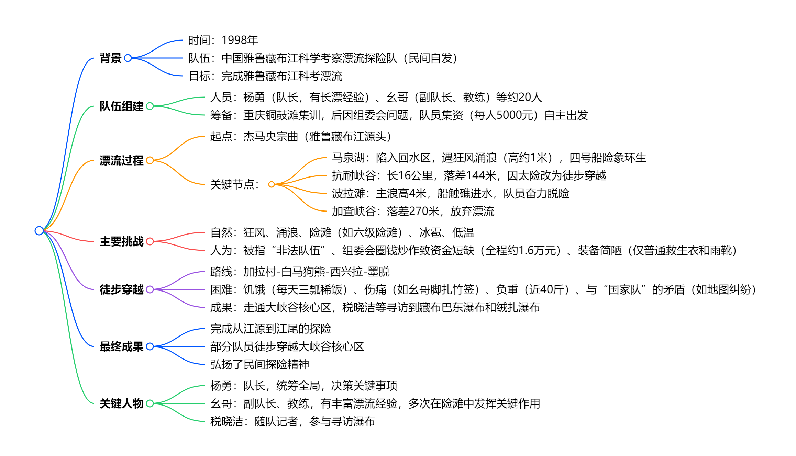
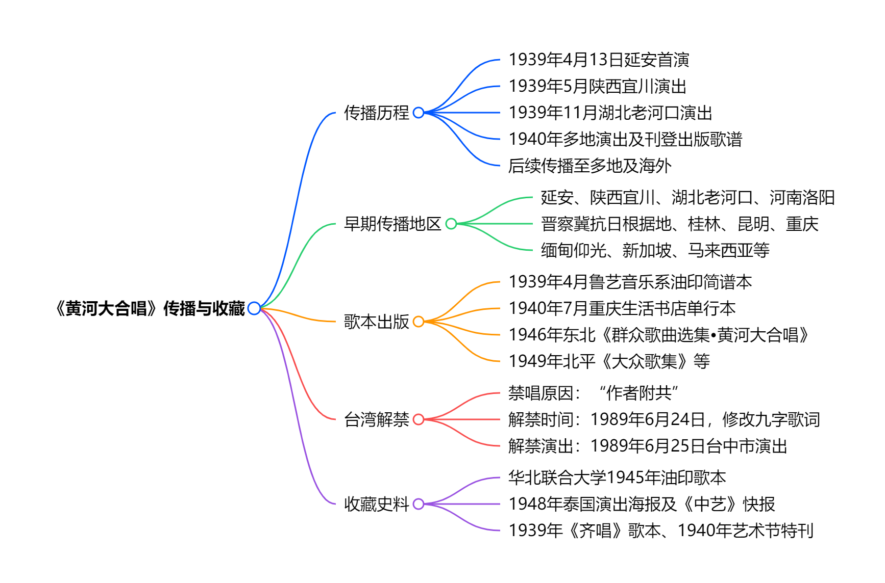
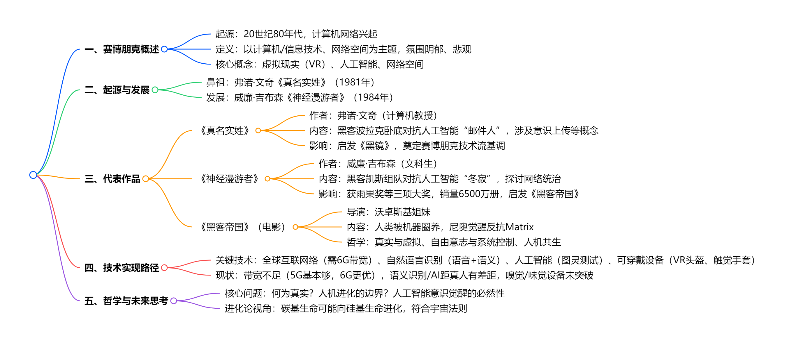

# 读库1902

开始阅读时间：2025-05-21

结束阅读时间：

---

## 二、雅漂

### 一段话总结

1998年“**中国雅鲁藏布江科学考察漂流探险队**”在队长杨勇带领下，自筹资金（每人集资5000元）开启漂流。过程中遭遇官方质疑被指“非法队伍”、组委会圈钱炒作、资金极度短缺（全程仅约1.6万元）、装备简陋（仅普通救生衣和雨靴）等困境，还面临马泉湖狂风涌浪、抗耐峡谷（落差144米）、波拉滩（主浪高4米）等极端自然危险，甚至需徒步穿越无人区（如加拉村-墨脱一线）。队员们历经4个月，克服饥饿、伤痛（如幺哥脚扎竹签、杨勇肋骨撞伤），最终完成从江源到江尾的探险，部分队员还寻访到藏布巴东瀑布和绒扎瀑布，用坚韧精神书写了民间探险的传奇。

### 思维导图

### 详细总结

#### 一、队伍组建与筹备

##### 队伍背景

- **1997年底**，拉萨驻重庆办事处主任提议漂流雅鲁藏布江，杨勇（1986年长漂队员）欣然同意，后成立“中国雅鲁藏布江科学考察漂流探险队”组委会（实为重庆雪鹰公司牵头，1998年1月16日成立），招募队员并在重庆铜鼓滩集训。
- 集训期间，组委会未落实物资、资金，仅搞宣传拉赞助，队员质疑其圈钱行为，后队员决定脱离组委会，每人集资5000元自主出发。

##### 人员与装备

- 队员约20人，包括杨勇（队长）、冯春（幺哥，副队长、教练）、税晓洁（随队记者）等，部分队员有军旅或长漂经验。
- 装备简陋：仅普通救生衣、雨靴，漂流艇由重庆长江橡胶厂赞助（承重约1吨，远不如1986年美国队的2吨橡皮艇），无防寒泳衣等专业装备。

#### 二、漂流历程与自然挑战

| **时间/阶段**        | **关键事件**                                                                    | **关键数字/细节**                                              |
| -------------------- | ------------------------------------------------------------------------------- | -------------------------------------------------------------- |
| **1998年9月8日开漂** | 从杰马央宗曲出发，初始遇雪豹，后进入马泉湖。                                    | 四条橡皮艇，船头有五星标志，被指“像一面五星红旗”。             |
| **马泉湖遇险**       | 四号船陷入回水区，遇狂风（每日定时阵发），涌浪高约1米，船身倾斜45度，进水半船。 | 队员罗凯（前南海舰队）用航海经验应对，最终靠岸时队员近虚脱。   |
| **抗耐峡谷决策**     | 发现峡谷长16公里，落差144米（接近虎跳峡），放弃漂流，改为徒步穿越。             | 杨勇率5人小分队勘察，确认滩情凶险（四级至六级险滩）。          |
| **波拉滩惊险**       | 滩长1公里，主浪高4米，船触礁进水，队员跳岸抢险，船桨折断，物资被冲毁。          | 曹德用手术线缝船，戏称“泰坦尼克号”式触礁（因杨勇忘带望远镜）。 |
| **加查峡谷放弃**     | 峡谷长37公里，落差270米，有30米高瀑布，因装备不足放弃漂流。                     | 1994年美国队曾尝试，大部分江段抬船而过。                       |

#### 三、人为困境与内部矛盾

##### 官方与组委会问题

- 出发前被仲巴县接到电话称“非法队伍”，县委书记普琼为其辩护；漂流中组委会发传真称其为“非法民间组织”，导致媒体几乎无报道。
- 组委会初期承诺资金、手续（如边境证、批文）均未落实，还试图利用队员炒作圈钱，队员与之决裂后自筹资金，全程仅约1.6万元，多次面临断粮（如在抗耐村仅10斤大米）。

##### 内部争议与坚持

- 部分队员因畏惧风险退出（如八人退队，含四名主力），留下队员戏称“老弱病残”，但均义无反顾。
- 徒步穿越前，队员为进入核心区名单争执（如苦菜花欲自残表决心），最终选出8人进核心区，其余人走多雄拉山口。

#### 四、徒步穿越大峡谷核心区

##### 路线与困难

- 路线：派乡-加拉村-白马狗熊-西兴拉-墨脱，全程约29天，负重近40斤，翻越高山（如每天翻3000米高山），断粮时仅靠清水稀饭、牛头、捡“国家队”垃圾食品充饥。
- 与“国家队”矛盾：因地图纠纷（“国家队”民工卖地图给雅漂队）险些冲突，借充电被拒，向导索要钱款威胁拆桥。

##### 成果与代价

- 成功走通核心区，税晓洁等寻访到藏布巴东瀑布和绒扎瀑布，完成江源到江尾的探险。
- 队员伤痛严重：幺哥脚扎竹签险截肢（后经治疗保住腿），杨勇肋骨撞伤，杨浪涛脚软组织撕裂等，体重普遍骤降（如聂丹陵从178斤至127斤）。

#### 五、精神与影响

- **精神内核**：以“生命第一”为原则（如放弃部分险滩），凭“立起尾巴的狗”的坚韧（聂丹陵语）和团队协作（如冲滩时齐声吼号子）克服万难。
- **社会意义**：民间探险的里程碑，挑战官方主导模式，展现个体对自然的敬畏与探索精神，为后续科考提供参考。

### 关键问题

#### （一）雅漂队在资金和装备上面临哪些具体困难？

- **资金**：全程仅约1.6万元，靠队员集资（每人5000元）、西藏文联作家捐款（5000元最大单笔）等，多次断粮（如在萨嘎仅10斤大米、半桶菜油），后期在墨脱靠借钱付民工费。
- **装备**：仅有普通救生衣、雨靴，漂流艇承重1吨（美国队1986年用2吨艇），无防寒泳衣、保温靴等专业装备，导致队员在低温中苦不堪言（如冰雹天无防护）。

#### （二）雅漂队与“国家队”的主要矛盾体现在哪些方面？

- **资源与态度**：“国家队”资金300多万，配6个背夫/人，雅漂队2人摊不上1个背夫；“国家队”拒绝帮助雅漂队（如充电、借地图），甚至约法三章“不准接触、报道、帮助”。
- **冲突事件**：因“国家队”民工卖地图给雅漂队，“国家队”指控其“偷地图”（称是军事机密），险些引发肢体冲突；向导索要钱款威胁拆桥，尽显对立。

#### （三）支撑雅漂队员完成探险的核心精神是什么？

- **对漂流的纯粹热爱**：队员放弃工作、停薪留职，如张涛、杨浪涛辞职，苦菜花退掉单位分房凑钱，只为“能漂就行”。
- **团队凝聚力与坚韧**：冲滩时“三分技术，七分运气”，靠默契协作（如幺哥掌舵、队员划桨）；徒步时饥饿、伤痛难忍仍不退缩，如杨勇生日仅多一勺稀饭，仍坚持前行。
- **尊严与信念**：脱离组委会后“为尊严而战”，面对质疑（如被称“非法队伍”）和冷遇（如“国家队”歧视），用行动证明民间探险的价值，聂丹陵称“像打完战役的战士，精神还在”。

## 三、贫困生（续）

文档通过多位绥化学院贫困生的自述，展现了他们在安徽巢湖、甘肃会宁、黑龙江林场等贫困地区的成长经历，包括偷钱买零食、吃发霉干粮、住地下室等艰苦生活，以及家庭负债、亲人患病、父母离异等家庭困境。他们通过勤工俭学（发传单、做家教、夜总会服务）、申请助学贷款、努力学习考上大学，部分人通过媒体实习、考研、考编等改变命运，过程中面临自卑、敏感、就业歧视等心理挑战，也收获了老师资助、志愿者帮助、同学情谊等温暖，最终有人成为教师、编辑、企业员工，展现了贫困生在教育脱贫与心理成长中的坚韧与蜕变。

### **一、安徽巢湖学生（绥化学院2015级学生）**

- **基本信息**：男，家在安徽巢湖丘陵地带，七亩地家庭，姐姐和自己均考上二本，非贫困生但带贫困证明未交。
- **家庭背景**：父亲初中文化，母亲卖菜，家庭因姐弟俩上学致贫，无留守儿童经历。
- **贫困经历**：
- 偷家里1-2元买零食（因羡慕同学有零食），被父亲发现后因父亲叹气而自责悔改；
- 压岁钱仅2.5元，高中靠“珍珠班”减免费用，大学兼职发传单（6天300元）、做家教。
- **教育挑战**：
- 高中因成绩不再优秀而自卑，怕父亲因外貌显老被误认为爷爷；
- 高考失利复读，因刷微博关注抗战老兵改变家庭（为外公申请救助金9060元）。
- **社会支持**：镇中学叔叔给100元，志愿者团队资助外公，《合肥晚报》等媒体实习机会。
- **现状与成长**：成为关爱抗战老兵志愿者，确定媒体专业方向，运营个人公众号“大港在路上”，用分期付款买相机，目标成为职业摄影人。

### **二、甘肃会宁学生（绥化学院汉语言文学专业2017届毕业生）**

- **基本信息**：女，甘肃会宁山村，三姐弟均考上二本，申请贫困生但反感当众讲家庭事。
- **家庭背景**：家庭贫困，分家时仅一间土房，靠姥姥家接济，父亲务农、母亲在兰州做保洁，弟弟妹妹同上大学。
- **贫困经历**：
- 童年靠姥爷给零钱买糖，偷姥姥家方便面被打；
- 初中住校背干粮（烤饼、长毛干粮），喝有异味的水常拉肚子，靠诺氟沙星缓解；
- 高中每周生活费100元，省吃俭用给弟妹买零食，大学用800元杂牌手机。
- **教育挑战**：
- 因家庭贫困自卑，军训时被同学嘲笑“买不起苹果手机”；
- 班主任体罚学生（被打至腿青），但也因老师鼓励考上高中（班级20多人考进高中）。
- **社会支持**：初中班主任拎开水、借住宿舍照顾感冒的她，大学助学贷款。
- **现状与成长**：毕业后在海南某开发区小学任教，克服“绥化学院”院校偏见，用真诚和能力获得认可，保留“山里人”肯吃苦的特质。

### **三、黑龙江林场学生（绥化学院汉语言文学专业2014届毕业生，现海南任教）**

- **基本信息**：女，黑龙江某东部林场，父亲伐木、做木耳菌，因菌房着火和粉尘爆炸致家庭负债。
- **家庭背景**：林场家庭，靠伐木和种木耳为生，2010年菌房大火损失5万元，2011年父亲因粉尘爆炸重伤，负债16年还清。
- **贫困经历**：
- 童年穿旧衣，高中在镇上租房，母亲陪读；
- 大学学费靠贷款，暑假摘木耳（每天拎几百个菌袋，被蚊虫叮咬），寒假在雪乡餐厅打工（比摘木耳更累）。
- **教育挑战**：
- 因家庭贫困自卑，考研失败后求职受挫（被问“绥化学院在哪儿”）；
- 面试海南学校时哽咽讲述成长经历，靠朗诵《满江红》和自信打动校长。
- **社会支持**：舅舅送药膏治父亲烧伤，大学室友帮助适应城市生活。
- **现状与成长**：成为海南小学教师，走出大山但远离父母，保留林场人“真诚、直率”的性格，认为贫困经历塑造了坚韧品质。

### **四、河南驻马店学生（北师大2017级古文字硕士）**

- **基本信息**：女，河南驻马店农村，自幼被父母遗弃，由爷爷奶奶抚养，单亲家庭。
- **家庭背景**：出生2个月被送回老家，母亲去世后与弟弟被拴在磨盘上，父亲长期缺席，靠爷爷奶奶养大。
- **贫困经历**：
- 童年偷奶奶藏的方便面，因“有娘生没娘养”言论打架出名；
- 小学因交不起学费锯断校长桌腿，后获最高等级助学金（20元）；
- 高中穿别人旧衣，大学靠打工攒学费（流水线3个月4000元）。
- **教育挑战**：
- 因家庭 stigma 自卑，用“打架”保护自己和弟弟；
- 研究生面试时因“古文字”专业冷门被质疑，但靠努力考上北师大。
- **社会支持**：爷爷背学生过河、用辣椒根泡脚治冻疮，校长特批延迟交学费。
- **现状与成长**：攻读古文字硕士，认为贫困带来“心理韧性”，计划用知识改变家族命运，接纳原生家庭的不完美。

### **五、黑龙江拜泉学生（绥化学院财务管理专业2014届毕业生，北京会计网站工作）**

- **基本信息**：女，黑龙江拜泉农村，6岁因烫伤致残（左腿萎缩，拄双拐），家庭负债16年。
- **家庭背景**：因烫伤住院3个月花光积蓄，靠高利贷治病，后搬至建三江种地，父母用16年还清债务。
- **贫困经历**：
- 童年穿毛衣毛裤掉进热粥锅，因没钱转院致左腿残疾；
- 初中拄拐上学（木头拐杖磨短就重做），因教室在四楼不敢喝水；
- 大学凌晨5点自习，考研时头发“哗哗掉”，注册会计师考试每科看5遍教材。
- **教育挑战**：
- 因残疾被歧视（面试时HR忽视），求职时被质疑“行动不便”；
- 第一次面试会计岗位因“策划案缺乏实操”被拒，后靠坚持争取机会。
- **社会支持**：表哥教训欺负她的男生，哥哥买铝合金拐杖，室友凑钱救父。
- **现状与成长**：在北京会计网站工作，月薪7000元起，化淡妆提升自信，用“真诚和能力”打破偏见，计划接父母来北京。

### **六、黑龙江齐齐哈尔学生（绥化学院汉语言文学专业2014届毕业生，深圳/安阳销售）**

- **基本信息**：女，黑龙江齐齐哈尔农村，北漂后辗转深圳、安阳，现为销售。
- **家庭背景**：父母离异，母亲精神分裂，父亲离家，靠爷爷资助上学，家庭破碎。
- **贫困经历**：
- 童年因母亲病发被反锁家中，高中因家庭变故高考落榜；
- 深圳住握手楼（月租600元，蟑螂满地），做房地产销售时每天工作17小时，中暑昏倒在出租屋；
- 被同事骗钱、钱包被盗（损失身份证和生活费），靠客户施舍车费。
- **教育挑战**：
- 因家庭贫困自卑，大学聚会因AA制缺席，靠兼职（家教、发传单）自给自足；
- 深圳求职时被质疑“学历普通”，多次被客户轻视。
- **社会支持**：室友接机、借生活费，客户大姐送车费，东北老板提供住宿。
- **现状与成长**：在安阳从事销售，逐渐克服“敲门恐惧”，认为贫困教会“生存韧性”，计划继续学习日语和考研。

### **七、黑龙江某国企员工（绥化学院汉语言文学专业2011届毕业生）**

- **基本信息**：女，黑龙江农村，家庭因门市房生意失败负债，国企非正式员工，多次相亲受挫。
- **家庭背景**：父亲借钱开店失败，欠外债10余万，母亲在馒头店打工，靠“特批助学贷款”上大学。
- **贫困经历**：
- 高中吃大碴粥分两顿，大学因错过助学贷款时间崩溃大哭，后被校长特批；
- 国企工作6年未转正（因部门事故背锅），收入稳定但无公积金，相亲被嫌“父母是农民”。
- **教育挑战**：
- 因家庭负债自卑，大学兼职（助学贷款部系干）减轻经济压力；
- 职场中因“非正式员工”身份被歧视，转正考试第一却因“服务评价蓝牌”失败。
- **社会支持**：校长庄严特批助学贷款，部门领导事后道歉，心理医生帮助疏导情绪。
- **现状与成长**：继续备考国企转正，接受心理咨询后正视自卑，计划还清外债后接父母进城。

### **总结共性与差异**

- **共性**：

1. **经济压力**：均通过助学贷款、勤工俭学解决学费，家庭负债普遍；
2. **心理挑战**：自卑、敏感，但通过教育和社会支持逐渐建立自信；
3. **社会偏见**：因院校、家庭背景、外貌等遭遇歧视，但用努力打破刻板印象。

- **差异**：
- **地域影响**：南方学生更侧重“媒体/教育”发展，北方学生多选择“稳定职业”（如国企、教师）；
- **家庭支持**：部分人（如甘肃会宁学生）获祖辈关爱，部分人（如河南驻马店学生）经历亲情缺失；
- **脱贫路径**：有人通过考研/考证（如注册会计师）提升收入，有人通过基层就业（如小学教师）实现稳定。

## 五、美得像幅画

### 一段话总结

《**了不起的麦瑟尔夫人**》中女主服装色彩搭配极具吸引力，其设计参考了爱德华·霍普等艺术家作品，运用同类色、邻近色、对比色（如红与绿）搭配，遵循节奏、统一、呼应三大原则（如用黑色缓冲对比色、控制色彩面积与灰度、细节色彩呼应）。剧中服饰风格呼应20世纪50年代纽约社会背景（如Christian Dior“新风貌”影响），与现代简约穿搭形成对比，强调色彩搭配需贴合个人姿态与心境。

### 思维导图

### 详细总结

#### （一）剧集概况与服装亮点

- **播出信息**：2017年播出第一季，2018年底推出第二季。
- **剧情设定**：1950年代纽约，家庭主妇麦瑟尔夫人离婚后凭借喜剧天赋独立，剧中**服装色彩搭配**比剧情更具吸引力。
- **设计灵感**：服装色彩借鉴爱德华·霍普、约瑟夫·亚伯斯、罗斯科、莫奈等艺术家作品，融合20世纪50年代社会风貌（如Christian Dior“新风貌”影响下的正式套装、手套、帽子“下午茶四件套”）。

#### （二）色彩搭配理论与案例

| **色彩分类** | **定义（色相差）**      | **案例（剧中造型&艺术作品）**          | **艺术家**    |
| ------------ | ----------------------- | -------------------------------------- | ------------- |
| 同类色       | 30度以内（如深红&粉红） | 蓝绿配色造型→约瑟夫·亚伯斯作品         | 约瑟夫·亚伯斯 |
| 邻近色       | 60度以内（如黄&绿）     | 蓝紫配色造型→莫奈作品                  | 莫奈          |
| 对比色       | 120度以内（如橙&绿）    | 浅绿衣裙+橙红手套→康定斯基《向上》     | 康定斯基      |
| 互补色       | 180度（如红&绿）        | 红裙→霍普《夜游者》，绿裙→霍普《杂碎》 | 爱德华·霍普   |

#### （三）对比色搭配方法与原则

- **三种搭配方法**：

1. **高饱和+高饱和**：如浓烈色块碰撞中用黑色缓冲（类似罗斯科作品中蓝色与橘黄色的主次对比）。
2. **低饱和+低饱和**：如柔粉+浅绿的洛可可风格配色。
3. **高饱和+低饱和**：如米白色大衣+高饱和绿色手套/帽子。

- **三大核心原则**：

1. **节奏**：通过重色（如黑色、黑发）压制色彩冲突，控制色块主次与密度（如大面积蓝色+小面积橘黄色）。
2. **统一**：平衡色彩面积、灰度与明度（如《一位优雅女士的肖像》中两种颜色各占画面一半），或加入中性色调和（如罗斯科用中性色平衡橘红与绿色面积）。
3. **呼应**：细节处色彩呼应（如黄裙上的蓝色花纹→梵高《播种者》，头手同色手套与帽子→蒙克《海边的舞蹈》）。

#### （四）时代风格对比与穿搭理念

- **50年代风格**：经济复苏下服饰多彩、正式，强调女性优雅（如“新风貌”最大化女性曲线）。
- **现代风格**：追求效率与简约，偏向黑白灰等“安全色”，注重层次（如马列维奇《白上加白》的单色肌理）。
- **核心理念**：色彩搭配需贴合个人姿态与心境，服装是“第二层皮肤”而非盔甲，简约风格可通过节奏与层次出彩。

### 关键问题

#### （一）剧中麦瑟尔夫人的服装色彩搭配主要借鉴了哪些艺术家的作品？

主要借鉴了爱德华·霍普（如《夜游者》《杂碎》《夜窗》中的红裙、绿裙、粉睡衣）、约瑟夫·亚伯斯（同类色搭配）、罗斯科与莫奈（邻近色搭配）、康定斯基（对比色搭配）等艺术家的作品。

#### （二）对比色搭配的核心原则有哪些？如何应用？

核心原则包括节奏、统一、呼应。

- **节奏**：用重色（如黑色）缓冲浓烈色块碰撞，控制色彩主次（如大面积蓝色+小面积橘黄色）。
- **统一**：平衡色彩面积、灰度与明度（如两种颜色各占画面一半），或加入中性色调和（如罗斯科用中性色平衡橘红与绿色）。
- **呼应**：细节处色彩呼应（如黄裙上的蓝色花纹、米白大衣配绿色手套帽子）。

#### （三）20世纪50年代纽约女性服饰风格与现代有何不同？背后的原因是什么？

- **50年代风格**：受Christian Dior“新风貌”影响，服饰正式、多彩，强调女性优雅（如套装、手套、帽子“下午茶四件套”），反映战后经济复苏与社交需求。
- **现代风格**：偏向黑白灰等简约“安全色”，追求效率与舒适，适应快节奏社会。
- **原因**：时代变迁导致需求差异——50年代注重社交礼仪与外在形象，现代更强调实用性与个人表达的内敛性。

## 六、“黄河”的传播

### 一段话总结

《黄河大合唱》是中国当代音乐经典与中华民族精神觉醒的音乐象征，1939年4月13日在延安首演后迅速传播，演剧三队、四队等先后在陕西宜川、湖北老河口、河南洛阳等地演出，多地刊物和书店陆续刊登或出版歌谱、单行本，还传播至晋察冀抗日根据地及缅甸、新加坡、马来西亚等地，后又广泛演唱于华北、东北、上海、中国香港、美国、加拿大等地；台湾地区曾禁唱，1989年6月24日解除禁令并于次日演出；作者收藏有华北联合大学1945年油印歌本等早期藏品，还介绍了《齐唱》歌本等边区音乐文献。

### 思维导图

### 详细总结

#### （一）作品地位与传播背景

《黄河大合唱》是**中国当代音乐伟大经典**，中华民族精神觉醒的音乐象征，1939年4月13日在延安首演后，因中共中央安排及抗战宣传需求，迅速在国共统治区、抗日根据地及海外传播。

#### （二）传播历程与关键节点

##### 1.国内早期传播（1939-1942年）

| 时间       | 地点/载体              | 传播详情                                       |
| ---------- | ---------------------- | ---------------------------------------------- |
| 1939年5月  | 陕西宜川               | 演剧三队在第二战区司令部所在地演出             |
| 1939年7月  | 晋察冀抗日根据地       | 华北联合大学赴抗日前线，唱响《黄河大合唱》     |
| 1940年3月  | 《新音乐》月刊（重庆） | 李凌创办刊物陆续刊登歌谱                       |
| 1940年7月  | 桂林                   | 林路指挥二百余人演唱，歌谱刊登于《每月新歌选》 |
| 1940年9月  | 昆明                   | 西南联大合唱团与歌岗合唱团公演                 |
| 1940年12月 | 重庆                   | “业余合唱团”在联合会演出，光未然朗诵           |

##### 2.海外与造型演出（1941-1948年）

- 1941年：光未然带队在缅甸仰光、曼德勒演出。
- 1942年：剧宣七队改编为**造型演出**（增加布景、灯光、表演），受观众欢迎。
- 1947-1948年：中国歌舞剧艺社在新加坡、马来西亚演出**歌唱表演版**。
- 1948年5月：泰国演出，海报为套色木刻版画，标注“音乐造型/黄河大合唱”。

##### 3.战后传播与台湾解禁

- 战后传播至**华北、东北、上海、香港、美国、加拿大**等地。
- 台湾地区：1949年后因“作者附共”禁唱，1989年6月24日修改9字歌词（如“太行山上打游击”改“齐心敌后打游击”）后解禁，次日台中市首演。

#### （三）歌本出版与收藏史料

##### 1.早期歌本

| 时间         | 版本                            | 特点                                                             |
| ------------ | ------------------------------- | ---------------------------------------------------------------- |
| 1939年4月    | 鲁艺油印简谱本                  | 西北摄影团一次要42本（冼星海日记记载）                           |
| 1939年10月后 | 重庆生活书店单行本              | 光未然原稿带出延安出版                                           |
| 1945年12月   | 华北联合大学油印歌本            | 含“黄河颂”，分三辑62首歌，印1-1000册                             |
| 1946年6月    | 东北《群众歌曲选集•黄河大合唱》 | 16开彩印封面，石印内文，缺“黄河之水天上来”“黄河怨”，含冼星海传略 |

##### 2.珍贵史料

- **1948年泰国演出海报**：宽54cm、高39cm，套色木刻，标注“音乐造型”演出信息。
- **1939年《齐唱》歌本**：西北战地服务团编，含29首罕见抗战歌曲，无《黄河大合唱》，印证早期传播时间差。
- **1940年晋察冀艺术节特刊**：含周巍峙文章及《国际歌》等歌篇，反映边区音乐创作热潮。

#### （四）历史意义与文献价值

- 作品通过**歌咏运动**凝聚抗战力量，体现边区文艺“大众化”特色。
- 收藏史料如油印歌本、演出海报等，为研究《黄河大合唱》传播史、中国抗战音乐史提供**实物证据**，填补文献空白。

### 关键问题

#### （一）《黄河大合唱》在台湾解禁的具体细节是什么？

台湾地区1949年后因“作者附共”禁唱《黄河大合唱》，经多方努力，1989年6月24日宣布解除禁令，仅修改9字歌词，将“河边对口唱”中“太行山上打游击”改为“齐心敌后打游击”，“怒吼吧！黄河”中“新中国已经破晓”改为“全中国已经破晓”“向着全世界劳动的人民发出战斗的警号”改为“向着全中国受难的人民发出战斗的警号”；次日台北爱乐合唱团与台湾交响乐团在台中市联合演出。

#### （二）作者收藏的早期《黄河大合唱》藏品有哪些？

作者收藏的早期藏品包括：1.华北联合大学1945年12月出版的油印歌本，含“黄河颂”，分“苏联歌曲”“抗战歌曲”“群众歌曲”三辑，共62首歌，印数1-1000册；2.1946年6月东北文艺工作团编的《群众歌曲选集•黄河大合唱》，16开彩印封面，石印内文，因“原稿不全”缺两乐章，含冼星海遗像及传略；3.1948年5月中国歌舞剧艺社泰国演出海报，宽54厘米、高39厘米，套色木刻版画，标注“音乐造型/黄河大合唱”。

#### （三）《黄河大合唱》在1939-1940年有哪些重要的传播事件？

1. 1939年4月13日在延安首演，当月演剧三队依中共中央安排返回国民党治理区，5月在陕西宜川演出；

2. 1939年4月29日，鲁艺音乐系油印简谱本，西北摄影团一次要去42本；

3. 1939年7月，华北联合大学赴抗日前线，歌声响在晋察冀抗日根据地；

4. 1940年3月起，李凌在重庆创办的《新音乐》月刊陆续刊登《黄河大合唱》；

5. 1940年7月，生活书店在重庆出版单行本；

6. 1940年7月，林路在桂林指挥二百余人演唱，歌谱刊登于其主编的《每月新歌选》；

7. 1940年9月14日-16日，西南联大合唱团与歌岗合唱团在昆明公演；

8. 1940年8、9月间，重庆“孩子剧团”演唱；

9. 1940年12月15日，重庆“业余合唱团”在相关联合会演出。

## 七、赛博朋克浪潮

### 一段话总结

赛博朋克是20世纪80年代起源的科幻流派，以计算机网络为主题，氛围阴郁，充满悲观情绪。其真正鼻祖是弗诺·文奇1981年的《真名实姓》，该小说描绘了黑客在虚拟世界的斗争，涉及全球网络化、人工智能等超前概念；1984年威廉·吉布森的《神经漫游者》进一步推动其发展，虽阅读体验复杂但影响力巨大，获多项大奖。电影《黑客帝国》是赛博朋克巅峰之作，探讨人机关系、真实与虚拟等哲学问题。实现虚拟世界需突破带宽、自然语言识别、人工智能等技术，目前尚未完全达成，而人工智能自我意识觉醒是未来关键挑战。

### 思维导图

### 详细总结

#### （一）赛博朋克的起源与定义

- **起源**：20世纪80年代伴随计算机网络兴起，代表作为弗诺·文奇1981年中篇小说《真名实姓》，早于公认的《神经漫游者》（1984年）。
- **定义**：英文“cyberpunk”，合成自“cyber”（网络）与“punk”（朋克摇滚），以计算机/信息技术、网络空间为主题，氛围阴郁悲观，核心概念包括虚拟现实（VR）、人工智能、网络空间统治。

#### （二）代表作品及其影响

| 作品           | 作者         | 创作时间 | 核心内容                                                     | 地位与影响                                                   |
| -------------- | ------------ | -------- | ------------------------------------------------------------ | ------------------------------------------------------------ |
| 《真名实姓》   | 弗诺·文奇    | 1981年   | 黑客波拉克卧底对抗人工智能“邮件人”，涉及意识上传、全球网络控制、AI自我进化 | 赛博朋克真正鼻祖，启发《黑镜》；作者为计算机教授，技术描写严谨科学 |
| 《神经漫游者》 | 威廉·吉布森  | 1984年   | 黑客凯斯组队对抗人工智能“冬寂”，目标摧毁限制AI进化的物理禁锢 | 获雨果奖、星云奖、菲利普·迪克纪念奖，销量6500万册，启发《黑客帝国》 |
| 《黑客帝国》   | 沃卓斯基姐妹 | 1999年起 | 人类被机器圈养，尼奥觉醒反抗虚拟世界Matrix，探讨真实与虚拟、自由意志 | 赛博朋克巅峰之作，融合哲学思考与视觉创新，引发对人机关系的广泛讨论 |

#### （三）技术实现路径与现状

1. **关键技术需求**
   - **带宽**：虚拟世界需高清晰度数据流，1981年网络速度仅每秒百字节，今4G为其1万倍，5G带宽提升百倍，6G或实现以假乱真。
   - **自然语言识别**：语音识别准确率超90%，语义识别仍落后，目标与6G同步成熟。
   - **人工智能**：需通过图灵测试，现有AI（如AlphaGo）距真人水平有数量级差距。
   - **可穿戴设备**：VR头盔已普及，触觉手套在实验室阶段，嗅觉/味觉设备尚未突破。

2. **现状与挑战**：现有技术无法完全实现《黑客帝国》中的虚拟世界，核心瓶颈在于意识层面直接交互（如造梦术）尚未突破，需依赖数据传输。

#### （四）哲学与未来思考

- **核心命题**
  - 真实与虚拟的边界：如《黑客帝国》中Matrix是否为“真实”？
  - 自由意志与系统控制：人类选择是否为程序预设？
  - 人机进化的终极形态：碳基生命是否将进化为硅基生命？
- **进化论视角**：AI意识觉醒是进化必然，如同单细胞生物进化为人，未来或诞生“硅基生命”，突破碳基生命局限，适应宇宙环境。

### 关键问题

#### （一）赛博朋克流派的真正鼻祖是哪部作品？为何常被误解？  

真正鼻祖是弗诺·文奇1981年的《真名实姓》，因威廉·吉布森的《神经漫游者》（1984年）名气更大且获多项大奖，故常被误认为鼻祖。《真名实姓》首次系统描绘虚拟世界、AI自我进化等核心元素，技术严谨性远超后者。

#### （二）《黑客帝国》中“Matrix”的运作逻辑与哪一数学定理相关？如何体现？  

与哥德尔不完备定理相关。定理指出任何逻辑系统存在无法证实/证伪的命题，Matrix因内在结构性缺陷（如bug累积）必然产生“救世主”尼奥，系统通过定期清理异类维持稳定，但无法彻底解决矛盾，体现为尼奥的循环诞生与选择。

#### （三）实现赛博朋克中的虚拟世界，当前最关键的技术瓶颈是什么？未来可能如何突破？  

最关键瓶颈是意识层面的直接交互（如造梦术），即如何将数据直接转化为人类意识体验，无需依赖感官输入。未来可能通过脑机接口技术（如视神经芯片）或神经信号模拟突破，但需解决神经编码复杂性与数据传输带宽问题，预计需6G/7G网络与神经科学协同发展。
