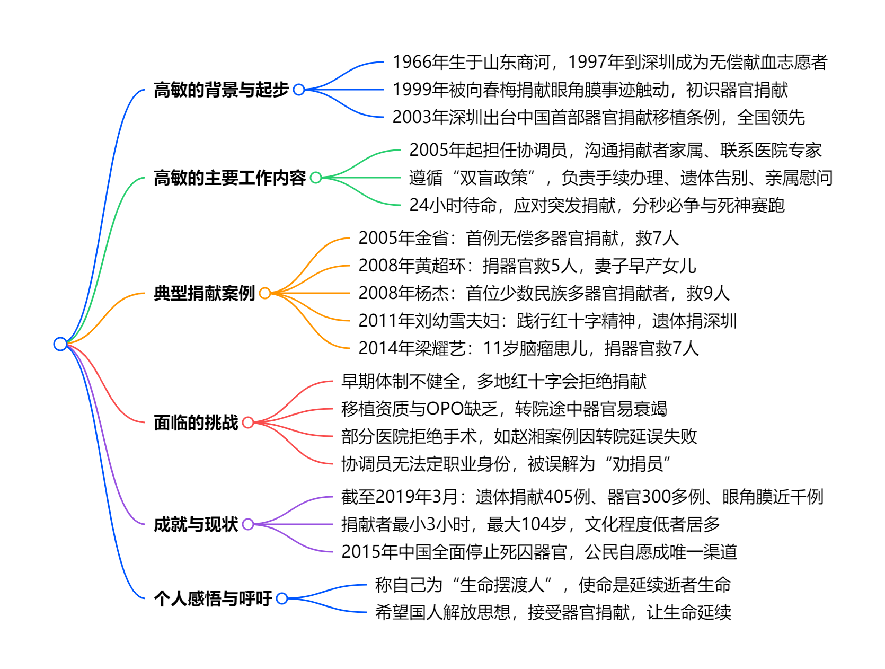

# 读库1903

开始阅读时间：2025-05-29

结束阅读时间：

---

## 生命摆渡人

### 一段话总结

本文讲述中国首位器官捐献协调员**高敏**的职业历程，她自1997年参与无偿献血后接触器官捐献工作，2005年促成我国**首例无偿多器官捐献案例（金省捐献器官救7人）**，2007年成为专职协调员，遵循“**双盲政策**”协调捐献者、医院及部门，历经诸多感人案例（如黄超环、杨杰、姚贝娜等），也面临移植资质缺乏、转院器官衰竭等挑战。截至2019年3月，她协调成功**遗体捐献405例、器官捐献300多例、眼角膜近千例**，呼吁国人解放思想，让生命延续生命。

### 思维导图

### 详细总结

#### (一)高敏的职业起点与深圳的政策领先性

- **背景**：1966年生于山东商河，1997年到深圳成为无偿献血志愿者，1999年因向春梅**中国首位无偿捐献眼角膜者**事迹，初次了解器官捐献。
- **政策基础**：2003年8月，《深圳经济特区人体器官捐献移植条例》出台，是中国首部相关法例，2007年全国《人体器官移植条例》颁布。

#### （二）关键工作节点与典型案例

| **时间** | **案例主角**       | **捐献情况**                                                           | **受益人数** |
| -------- | ------------------ | ---------------------------------------------------------------------- | ------------ |
| 2005年   | 金省（18岁高中生） | 因交通事故脑死亡，捐献肾脏、肝脏、眼角膜                               | 7人          |
| 2008年   | 黄超环（26岁）     | 车祸脑死亡，捐献眼角膜、肝脏、肾脏                                     | 5人          |
| 2008年   | 杨杰（26岁布依族） | 脑死亡，捐献心脏、肝脏、肾脏、皮肤、眼角膜，**国内首位少数民族捐献者** | 9人          |
| 2011年   | 刘幼雪夫妇         | 程芸平捐献眼角膜和遗体，刘幼雪六年后捐献遗体，**践行红十字精神**       | -            |
| 2014年   | 梁耀艺（11岁）     | 脑瘤去世，捐献肝脏、肾脏、眼角膜、遗体，**最小多器官捐献者之一**       | 7人          |
| 2015年   | 姚贝娜             | 捐献眼角膜，**三位患者重见光明**                                       | 3人          |

#### （三）工作挑战与困境

1. **体制与流程问题**
   - 早期无成熟捐献体系，如金省母亲打多地红会电话被拒；
   - 深圳缺乏移植资质与OPO，需转院至广州等地，导致器官在途中衰竭（如赵湘案例因医院拒绝手术转院延误，器官失效）。
2. **时间压力与医学限制**
   - 器官热缺血时间严格（心脏3-4分钟，肝脏5-8分钟），需分秒必争；
   - 部分案例因死亡证明开具延迟、医院不配合失败（如2012年湖南女孩赵湘）。
3. **社会认知与协调员身份**
   - 被误解为“劝捐员”，实际遵循自愿原则，不主动劝说；
   - 无法定职业身份，缺乏晋升机制与工资标准。

#### （四）成就与数据

- 截至2019年3月：
  - 协调成功**遗体捐献405例、器官捐献300多例、眼角膜近千例**；
  - 捐献者年龄跨度大，最小出生3小时，最大104岁；
  - 文化程度以初高中为主，部分未读书。

#### （五）个人理念与社会呼吁

- **角色定位**：称自己为“生命摆渡人”，使命是在逝者与生者间搭建通道，延续生命；
- **呼吁**：2015年中国全面停止死囚器官，公民自愿成唯一渠道，呼吁国人解放思想，接受“生命延续生命”的理念。

### 关键问题

#### 1. 高敏在器官捐献领域的最重大贡献是什么？

2005年协调促成**我国首例无偿多器官捐献案例（金省案）**，金省捐献的肾脏、肝脏救3人，眼角膜助4人重见光明，共挽救7人生命，为后续器官捐献工作奠定实践基础。

#### 2. 器官捐献协调员在工作中面临的最大技术挑战是什么？

**器官保存时间的严格限制**。心脏、肝脏等器官热缺血时间极短（心脏仅3-4分钟），需快速完成捐献者评估、转院、手术等流程。深圳早期因缺乏移植资质与OPO组织，需转院至外地，常导致器官在途中衰竭，如赵湘案例因转院延误失败。

#### 3. 深圳在全国器官捐献工作中的领先性体现在哪些方面？

- **政策先行**：2003年出台《深圳经济特区人体器官捐献移植条例》，是中国首部相关法例，早于全国条例4年；  
- **实践探索**：早期开展“三献”（献器官、骨髓、角膜）宣传，高敏通过医院发放资料、街头讲解等方式推动捐献，积累了全国首批捐献案例（如向春梅捐献眼角膜）。
