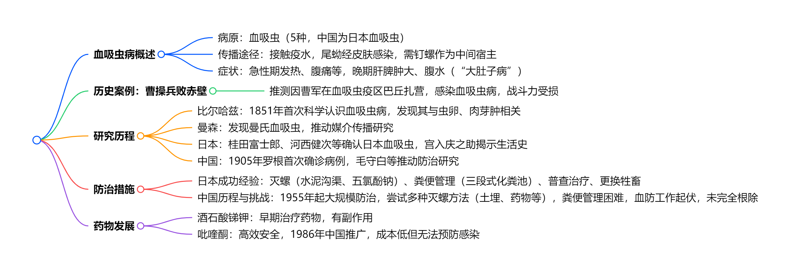
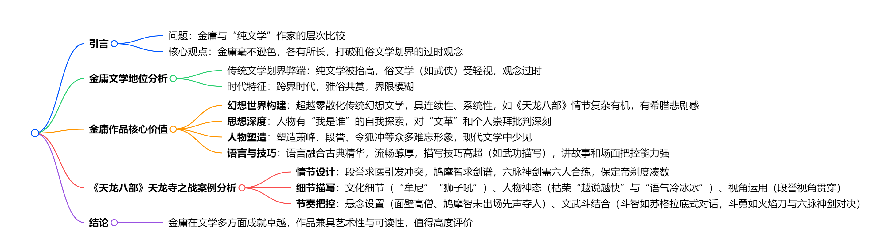

# 读库1901

开始阅读时间：2025-05-12

结束阅读时间：2025-05-18

---

## 01-如果物质文明瞬间消失

### 一段话总结

文档假设物质文明瞬间消失的"大灾变"场景，规定物质文明定义后，分三部分推演人类文明崩溃与重建：**初期超10亿人瞬间死亡，幸存者面临洪水、干渴、饥荒、瘟疫、寒冬等多重危机，人相食现象爆发**；随后世界人口骤降至2亿以下，自然快速复苏；**幸存者逐步重建农牧业、工业与科学，科学火种依赖基础教育传承，后文明可能在200-300年内重启工业革命，但地区差异显著**。

### 思维导图

### 详细总结  

#### 一、物质文明消失的定义与范围

**定义**：文明社会中因人类有目的行为产生、存在于人体外部的事物，包括工农业资产、人造物、驯化生物及代谢产物（如塑料、碳排放）。

**例外**：

1. 自然环境改变（如大气成分、土壤状态）不计入。

2. 驯化生物：文明社会正在种植/养殖的驯化物种消失，前文明驯化物种（如小麦、家犬）及未成功驯化物种（如日本鳗鲡）保留。

3. 特殊案例：伦敦地铁蚊子（新物种）、人工野化动物（如朱鹮、麋鹿）不消失。

#### 二、大灾变初期：毁灭性冲击

1. **直接死亡与基础设施崩塌**
   - **死亡人数**：超10亿人瞬间死亡，因高楼地基消失、交通工具失事、填海区域沉没等。  
   - **典型区域**：荷兰（低地国家）、沿海城市（如上海、纽约）受灾最重。  

2. **次生灾害链**

| **危机类型** | **影响范围与后果**                                         | **关键数据/案例**                              |
| ------------ | ---------------------------------------------------------- | ---------------------------------------------- |
| 洪水         | 中国长江、黄河流域首当其冲，三峡等水库溃决引发洪峰         | 黄河洪峰推进渤海入海口数里，长江中下游堤防溃决 |
| 干渴         | 城市地表水迅速渗漏，干旱地区幸存者脱水死亡                 | 无河流城市死亡率超90%                          |
| 饥荒         | 全球粮食系统崩溃，人口从75亿骤降至旧石器时代水平（千万级） | 每平方公里土地仅能养活1人，人相食事件频发      |
| 瘟疫         | 腐尸污染引发尸碱中毒、霍乱、鼠疫等                         | 全球爆发急性传染病，死亡超10亿人               |
| 寒冬         | 北半球冬季致30亿人冻死，南半球压力较小                     | 北纬30°以北地区几乎无幸存者                    |

#### 三、自然复苏与人类适应

1. **自然生态反弹**
   - **植被与物种**：野草灌木疯长，湖泊湿地恢复（如洞庭湖、咸海），候鸟迁徙成功率提升，野生动物种群爆发（如欧洲原牛、高鼻羚羊）。  
   - **环境变化**：碳排放消失使气候凉爽，污染减轻，能见度提升10倍。  

2. **人类生存策略**
   - **技能重建**：钻木取火、制陶、骨器制作（如骨针、骨矛），利用人皮制作衣物。  
   - **社会结构**：形成数百人小型社群，以血缘和熟人关系为纽带，民主讨论公共事务（如粮食分配、防御工事）。  
   - **知识传承**：用泥板、石片记录科学与宗教，方舟图书馆储存基础科学（如物理定律、化学元素）和生存技能。  

#### 四、后文明重建的核心挑战

1. **农牧业瓶颈**
   - **单产低下**：无化肥农药，粮食单产仅为前文明的1/10（如小麦单产从5吨/公顷降至0.5吨/公顷）。  
   - **驯化进程**：优先驯化黄鼠、穴兔等繁殖快的物种，杂交选育农作物（如野生稻与栽培稻杂交）。  

2. **工业复兴障碍**
   - **手工业局限**：无金属工具，木制织布机、陶器窑炉需从头发明，冶金依赖露天矿和陨铁。  
   - **交通制约**：缺乏马匹，无法运输大宗矿产（如铁矿与煤矿分离），工业革命推迟200-300年。  

3. **科学与宗教的冲突**
   - **知识断层**：现代科学仅存于初代幸存者记忆，碎片化知识难以重构体系（如高能物理无法实践）。  
   - **宗教演变**：现有宗教分裂为万余个教派，新宗教（如“科学教”）将科学神化，形成信仰冲突。  

4. **政治与社会形态**
   - **民主雏形**：数百人社群实行直接民主，无阶级分化（因缺乏垄断性武器）。  
   - **城邦联盟**：文化认同促进邻近社群合并，但缺乏畜力导致统一政权难以形成。  

### 关键问题

#### 问题：大灾变初期导致人类大量死亡的最主要原因是什么？

**答**：直接死亡源于基础设施崩塌（如高楼、交通失事），但次生灾害中的饥荒和瘟疫是主要杀手。全球粮食系统崩溃导致至少50亿人饿死，腐尸引发的传染病又收割超10亿生命。

#### 问题：后文明重建中，科学传承的最大障碍是什么？

**答**：知识载体消失与专业人才匮乏。书籍、硬盘等毁灭，科研设备荡然无存，且掌握科学的幸存者多集中于城市（早期死亡惨重），剩余知识碎片化，难以重构完整体系。

#### 问题：自然复苏对后文明的双重影响是什么？

**答**：
积极：植被恢复提供食物与建材，野生动物种群扩大成为狩猎资源，湖泊湿地净化水源。
消极：入侵物种（如海蟾蜍）失控，部分地区（如西非）因森林砍伐失去退路，加剧生存竞争。

### 我想说的话

一个人就靠想象能写出来这么一篇文章，我也是很佩服，可我对本文并不感兴趣 o(╥﹏╥)o

## 02-《四郎探母》复出四十年

### 一段话总结

京剧《四郎探母》历史悠久，曾深受慈禧太后喜爱，但1949年后因杨四郎在番邦的经历被禁演长达三十年，期间历经波折。**“文革”后，郭永江为其鸣不平，文章引发反响**。1979年风雷京剧团率先演出，后中国戏曲学院实验京剧团等也陆续演出。1980年《北京晚报》主办的演出引起轰动，场场爆满。这出戏还培养了众多演员，如安云武、李维康、耿其昌等。2007年福建省京剧团将其带到法国演出，同样大获成功。如今，《四郎探母》已成为经典保留剧目，深受观众喜爱。

### 思维导图

### 详细总结

#### 《四郎探母》的历史背景与禁演

京剧《四郎探母》历史悠久，清朝沈容圃的戏画《同光十三绝》中就有杨月楼饰演的杨四郎和梅巧玲饰演的萧太后。梅巧玲演出的版本深受慈禧太后喜爱。然而，1949年后，因杨四郎在番邦隐名埋姓的驸马生活，这出戏被视为有“争议”的戏。1949年《人民日报》社论指出其为“有害”剧目，此后长达三十年被禁止、批判，在“文革”期间更是与“党内最大的走资本主义道路的当权派”相联系，被戴上“大叛徒”的帽子。

#### “文革”后的复出历程

- **呼吁解禁**：“文革”结束后，郭永江在1978年底上海昆剧团进京演出《蔡文姬》时，在《会刊》发表《蔡文姬和杨延辉》为《四郎探母》鸣不平，文章被《上海戏剧》转载后引发强烈反响，支持和反对恢复演出的意见针锋相对。

- **首次演出**：1979年，郭永江说服风雷京剧团排演《四郎探母》，在大众剧场演出，虽未获公开演出许可，但演员和观众反应热烈。之后，中国戏曲学院实验京剧团也进行了演出。

- **公开演出**：1980年，《北京晚报》主办《四郎探母》演出，经多方努力获得文化部领导同意，在中国戏曲学院实验京剧团和大专班联合演出，在天桥剧场连演七场，场场爆满，引发“九城轰动”，但此次演出因争议未安排四夫人角色。

#### 重要演员的表演与贡献

- **安云武**：马连良的最后一位学生，其在《四郎探母》中《见娘》的甩发表演精彩，下苦功夫练习，演出超过二百场。

- **李维康和耿其昌**：夫妻档演员，演出的《坐宫》一折精彩绝伦，生活中的夫妻感情融入舞台表演，深受观众喜爱。

- **童芷苓**：在1983年演出的《坐宫》中，融合梅、尚、程、荀四派表演风格，展现出铁镜公主的不同气质。

- **国外演出情况**：2007年，福建省京剧团受邀请参加巴黎中国传统戏曲节，演出全本《四郎探母》。为适应法国观众，对剧情进行了调整，如去掉定场诗和部分道白、精简小生唱段等。演出非常成功，戏票提前两个月售罄 ，法国观众被剧中的人性和情感所打动。

| 演出时间        | 演出剧团                           | 演出地点             | 演出情况                               |
| --------------- | ---------------------------------- | -------------------- | -------------------------------------- |
| 1979年          | 风雷京剧团                         | 大众剧场             | 率先演出，引发关注但未公开演出         |
| 1980年4月1日    | 中国戏曲学院实验京剧团             | 原北京军区总医院礼堂 | 进行教学示范演出                       |
| 1980年12月3-9日 | 中国戏曲学院大专班和实验京剧团联合 | 天桥剧场             | 《北京晚报》主办，场场爆满             |
| 1985年          | 安云武个人演出                     | 未提及具体场地       | 连演三天，演出成功并正式调入北京京剧院 |
| 1983年4月       | 童芷苓与汪正华                     | 北京                 | 演出《坐宫》，展现独特表演风格         |
| 2007年          | 福建省京剧团                       | 法国巴黎             | 参加戏曲节，大获成功                   |

### 关键问题及答案

#### 问题1：《四郎探母》在“文革”后复出遇到了哪些阻力？

**答**：首先，《四郎探母》此前被认定为“坏戏”，有“叛徒”等负面标签，人们心存顾虑。其次，文化部门部分领导对此存在不同意见，如北京市主管文化的负责人起初只允许内部演出观摩，不允许公演。此外，社会舆论对该剧存在争议，反对者认为杨四郎“停妻再娶”等情节有道德问题和不良社会影响。

#### 问题2：《四郎探母》在国外演出时做了哪些调整？为什么要这样调整？

**答**：在国外演出时，去掉了杨四郎开场的定场诗和部分道白，将“四猜”的四句唱词连起来唱并在胡琴过门中加简短对话，精简了杨宗保巡营时小生的唱段。这样调整是因为原剧演出时间过长，法国观众难以理解小生用尖嗓子的演唱方法，且部分情节拖沓，影响整体节奏。调整后的版本既保留了原剧精华，又更符合法国观众的观演习惯。

#### 问题3：《四郎探母》能够久演不衰的原因是什么？

**答**：一是其剧情围绕父子情、夫妻情、兄弟情、兄妹情等，情感真挚，能引起观众共鸣，如《见娘》《坐宫》等情节深受观众喜爱。二是剧中行当齐全，唱段经典，集中了西皮音乐的所有板式，节奏紧凑，艺术价值高。三是经过时间的检验和沉淀，随着时代发展，人们对其的理解和接受度发生变化，曾经的争议点逐渐被淡化 。

### 我想说的话

1. 我没有过京剧的观看经验，我的姥爷在我小的时候倒是很爱看京剧。现在主要是时间过于宝贵，如果就是2-3个小时，听一出慢慢悠悠的戏曲，感觉过于浪费时间了。不过通过本文我还是能够感觉出来真正喜爱戏曲的人，对戏曲的热爱，戏曲本身的魅力。

2. 感觉读库中好多这位作者写的该类型文章了。挺好的，用文字感受戏曲魅力！

3. 《四郎探母》复出的故事也反映出文革期间的一些思潮，我觉得很有启发。

4. 2025年5月16日看了一段，还很有启发。[《四郎探母》（耿其昌 李维康）-B站链接](https://www.bilibili.com/video/BV11s411d7ys/)

## 03-学美术，教美术

### 一段话总结

本文以第一人称视角回顾了作者从1932年出生于北京昌平东营村的成长经历，包括家庭背景（祖父文秀才、父亲从金店学徒到经营银楼等）、童年被绑架、求学经历（村塾、卞氏小学、河北省立天津中学、国立北平艺专及中央美院学习，留学苏联列宾美院）、教学实践（初三开始代课、创办义务小学等）、工作经历（任教中南美专、广州美院，筹建师范系，担任副院长），以及在艺术教育理念（重视师资培养、倡导艺术与社会服务结合等）和人生态度（受多位老师影响、推崇集体主义等）方面的感悟，展现了其与时代变迁交织的人生轨迹。

### 思维导图

### 详细总结

#### 一、家庭与童年：成长底色与早期经历

**家庭背景**：出生于北京昌平县东营村，家族据说是看守明十三陵军士后裔，祖上从山西移民至东北再迁至此。祖父为文秀才，二爷是武秀才。父亲14岁时祖父去世，家道中落，经人介绍到北京大栅栏金店做学徒，后在天津与人合伙开首饰工厂、“恒义银楼”，因时代变迁改营食堂、镜框加工等，1963年因三年自然灾害影响健康去世。母亲善良贤惠，操持家务、做针线活，教孩子穿针线等，其淳朴品行影响孩子。伯父学过中医，疼爱作者，用中药斗上的药名做成字卡教其认字，作者三岁时认识一百多字。

**童年波折**：虚八岁时（约1939年）生日当天被土匪绑架，辗转三个村子，一周后父亲借600大洋赎回（当时店铺掌柜月工资十几块大洋，高级知识分子如徐悲鸿月工资300光洋）。为避匪患，母亲带其搬至县城，后移居天津。

#### 二、求学之路：从村塾到留苏，奠定艺术与教育基础

| 阶段       | 学校/经历                                  | 关键信息                                                                                                                                                                                           |
| ---------- | ------------------------------------------ | -------------------------------------------------------------------------------------------------------------------------------------------------------------------------------------------------- |
| 小学       | 北京昌平县村塾                             | 学习《百家姓》《弟子规》《三字经》《千字文》，能背诵但不太懂含义                                                                                                                                   |
|            | 天津卞氏小学、公立第三小学                 | 五年级时日本投降，班主任张云英老师帮其补习算术，助其考入初中；孙老师教美术和武术，启发艺术兴趣                                                                                                     |
| 初中       | 河北省立天津中学（后改天津市第三中学）     | 1946年考入，校长建议考此校（免学费），喜爱几何学，受美术老师王雪楼、胡定九鼓励学美术，胡老师学生有刘炳森等；初三时被选中教民众小学美术课，开始教学锻炼                                             |
| 高中及大学 | 国立北平艺专（1949年入学，后改为中央美院） | 1949年考入，校长徐悲鸿，入学前参加素描补习班，入学后志向填“教育”，受徐悲鸿影响重视教学；师资力量强，学素描、图案、雕塑、水彩等，参与暑期实践（如京浦线铁路系统体验生活、华北物资交流展览会布置等） |
| 留学       | 苏联列宁格勒列宾美术学院                   | 1955年赴苏，1960年因中苏关系紧张提前毕业；学习期间参观博物馆、临摹作品，暑期深入社会（农村、工厂、部队等）实践，毕业设计《过雪山》画稿丢失                                                         |

#### 三、教学与工作：深耕美术教育，推动学科发展

- **教学实践**：初三开始教民众小学美术课，后在中央美院创办义务小学，教失学儿童；留学回国后任教中南美专、广州美院，1981年筹建广州美院师范系，招生20名（次年40名），强调培养中小学美术老师的重要性，认为其关系民族未来。
  
- **工作经历与理念**：担任油画系副主任、副院长，推动服装、广告、环境艺术等新专业发展，如以“染织专业（服装班）”等名义开设相关课程；重视学术公平严谨，如处理学生毕业创作抄袭、评审外校硕士论文等；对待学生错误以教育为主，如处理偷窥、露体学生，给予改正机会；秉承学校风格，不拉关系走后门，专注工作成效。

#### 四、时代印记与个人感悟

- **时代影响**：经历抗日战争、解放战争、新中国成立、“文革”等时期，“文革”期间被批斗，关“牛栏”40天左右；参与抗美援朝宣传、土改宣传等活动，受《钢铁是怎样炼成的》《把一切献给党》等书籍影响，推崇集体主义、公共事业心。
  
- **艺术与教育感悟**：强调老师对学生的培养引导作用，认为社会缺少师资，应重视培养；艺术源于生活，需深入社会体验；主张艺术与社会服务、经济开发结合，如开发建筑模型、利用材料发展产业链等；各画种应平等，反对狭隘民族主义，要有博大胸怀。

### 关键问题

#### 问题1：父亲的职业经历有哪些重要转折点？

**答**：父亲14岁家道中落，到北京金店做学徒，因亲戚资助去天津与人合伙开首饰工厂，后和三位朋友在天津南市开“恒义银楼”；日本投降后，因国民党换金圆券、天津解放后金银统购，银楼改家庭饭馆，母亲做内厨；后楼下做镜框加工（公私合营、大集体制），父亲成为职工，1960年被调去当厨师，1963年去世。

#### 问题2：作者留学苏联列宾美院期间有哪些重要经历？

**答**：1955年赴苏，学习期间课堂认真学习，课余参观博物馆、临摹作品，暑期深入农村、工厂、部队等实践（如1956年去格鲁布考瓦农村、1958年列宁格勒造船厂实习、1959年德聂勃尔河小镇实习并去部队体验生活）；1957年暑假回国实习，与高志相识相恋；1960年因中苏关系紧张提前毕业，毕业设计《过雪山》画稿丢失，留在苏联的衣物及画作托运回广州。

#### 问题3：作者在广州美院筹建师范系的背景和理念是什么？

**答**：背景：1980年文化部传达社会需要大量美术老师，学校领导认为应办师范专业，作者响应并参与筹建，1981年开始招生。理念：认为中小学美术老师培养很重要，二十年后学生成为家长，其教育水平影响孩子和民族未来；鼓励师范系学生挺起胸，不要觉得低人一等，要重视培养其知识结构和能力；认为从事普及性工作不是离专业远，是观念误区，应公平对待各画种和专业。

### 我想说的话

文章中提到了“三不原则”，我找了一下什么是“三不原则”，学习了！

> 不抓辫子：不揪住别人的小问题或错误不放，避免无限上纲上线。 不戴帽子：不随意给他人扣政治帽子（如“右派”“反革命”等）。 不打棍子：不通过暴力或政治手段压制不同意见。
>
> “三不原则”（不抓辫子、不戴帽子、不打棍子）的来源是邓小平在1978年提出的改革开放初期的政治方针，旨在恢复民主传统、鼓励思想解放，是中共十一届三中全会的重要理论成果之一。这一原则的提出和实施，对中国的政治、文化和社会发展产生了深远影响。

## 04-送瘟神

### 一段话总结

该文章围绕血吸虫病展开，其由血吸虫寄生引起，通过接触疫水传播，症状包括发热、腹痛等，严重可致肝脾肿大、腹水。医学家推测曹操兵败赤壁或因曹军感染血吸虫病。血吸虫病历史悠久，分布广泛，全球约2亿人患病。德国医生比尔哈兹最早科学研究血吸虫病，曼森发现不同亚型血吸虫，日本学者桂田富士郎等推动日本血吸虫病研究。日本通过灭螺（如水泥沟渠改造、五氯酚钠喷洒）、粪便管理等措施成为首个根除血吸虫病的国家。中国血吸虫病流行已久，1955年起大力防治，经历诸多挑战，虽取得一定成效（如余江“送瘟神”），但尚未完全根除，后引入吡喹酮治疗，虽疗效显著但面临预防难题，目前七省仍有流行。

### 思维导图

### 详细总结

#### 一、血吸虫病基础认知

**病原与分类**：血吸虫属寄生虫，需中间宿主（钉螺）和终宿主（人类/哺乳动物）。能感染人类的有5种：埃及、曼氏、日本、湄公河、间插血吸虫，中国仅有日本血吸虫，其虫卵无棘突，感染可致肝脾肿大、腹水。

**传播机制**：

1. 虫卵随粪便污染水源，孵化毛蚴→侵入钉螺→发育为尾蚴→接触人体皮肤感染。  
2. 尾蚴侵入皮肤2天内出现红疹，2-3周后成虫排卵引发免疫反应（急性期症状）。

**危害数据**：

全球：目前约2亿人感染，每年约20万人死亡。  

中国：1950年代感染人数约1000万，钉螺面积1.4万平方公里，牲畜感染率20%-40%。

#### 二、历史与研究进展

1. **曹操兵败赤壁新视角**

   曹军在血吸虫疫区巴丘扎营，接触疫水后约3周大面积发病，符合血吸虫病潜伏期（2周）和症状（高热、乏力），推测因感染血吸虫病导致战斗力崩溃。

2. **关键研究突破**  

   | 时间/人物           | 贡献                                                   |
   | ------------------- | ------------------------------------------------------ |
   | 1851年 比尔哈兹     | 首次科学证实血吸虫病由虫卵引起，发现肉芽肿与症状关联   |
   | 1876年 曼森         | 发现曼氏血吸虫，证明蚊子传播丝虫病，启发疾病媒介研究   |
   | 1904年 桂田富士郎   | 日本首次从猫体内发现日本血吸虫，确认“片山病”为血吸虫病 |
   | 1911年 宫入庆之助   | 揭示日本血吸虫生活史，确认钉螺为中间宿主               |
   | 1905年 罗根（中国） | 首次确诊中国血吸虫病例（湖南）                         |

#### 三、防治实践：日本 vs 中国

1. **日本：唯一根除血吸虫病的国家**  
   - **核心措施**：  
     - **灭螺**：水泥沟渠改造（钉螺需遮荫潮湿环境，水泥化后无法存活）、五氯酚钠喷洒。  
     - **粪便管理**：三段式化粪池，生石灰处理，禁止污染水源。  
     - **普查治疗**：常年粪检，早期阳性率44.2%（1949年），1977年最后一例，1996年宣布灭绝。  
   - **关键支撑**：政策执行力强、卫生习惯良好（如1655年已立法管理粪便）。
2. **中国：长期挑战与阶段性成果**  
   - **治理历程**：  
     - **1955年启动**：毛泽东批示“消灭血吸虫病”，成立九人小组，重点灭螺（土埋、药物）、粪便管理（改造粪缸）、治疗（酒石酸锑钾，早期死亡率约4%）。  
     - **余江奇迹（1958年）**：动员4万人填埋沟渠200公里，治愈95.5%病人，成为首个“灭螺县”，但后续因大跃进冒进导致疫情反复。  
     - **药物升级**：1986年推广吡喹酮（国产成本为德国1/14），治愈率达98.9%，但无法预防感染。  
   - **现存问题**：  
     - 钉螺繁殖力强（残留3-5只母螺可次年繁衍千万后代），七省（湘、鄂、赣等）仍有流行，2001年感染人数超80万。  
     - 粪便管理难度大（如湖区渔民随地排便），卫生习惯未根本改变。

#### 四、药物治疗发展

| 药物/时间            | 特点         | 疗效/副作用                                                   |
| -------------------- | ------------ | ------------------------------------------------------------- |
| 酒石酸锑钾（1921年） | 早期主要药物 | 疗效65%，但毒性强，需严格按体重给药，早期死亡率4%             |
| 吡喹酮（1975年）     | 现代首选药物 | 单剂口服，治愈率98.9%，副作用轻（恶心、头晕），中国1986年推广 |

### 关键问题

#### 问题：为何推测曹操兵败赤壁与血吸虫病有关？

**答**：曹军在巴丘（岳阳，血吸虫疫区）扎营，接触疫水后约3周大面积发病，症状（高热、乏力）与血吸虫病潜伏期（2周）和急性期表现吻合，且史料记载曹军“救火无力”，符合感染后战斗力衰退特征。

#### 问题：日本为何能成为全球首个根除血吸虫病的国家？

**答**：

- **理论清晰**：本土研究透彻（如桂田、宫入等学者揭示病原与生活史）。  

- **政策执行坚决**：政府主导灭螺（水泥沟渠、药物喷洒）、粪便管理（化粪池补贴），民众配合度高（如主动接受粪检）。  

- **卫生基础好**：长期重视环境卫生（如17世纪禁止向河流倒垃圾），明治维新后吸纳现代卫生观念。

#### 问题：吡喹酮在中国血吸虫病防治中起到了什么作用？为何仍未彻底解决问题？

**答**：

- **作用**：吡喹酮高效安全，1986年推广后使患病率下降，治愈率达98.9%，且国产成本低（德国药1/14），成为主要治疗药物。  

- **局限**：药物仅能治疗现症，无法预防感染；中国疫区钉螺未彻底消灭（繁殖力强），且粪便管理、卫生习惯等问题未根本解决，导致重复感染风险高。

### 我想说的话

我记得《沧浪之水》中好像有描写血吸虫防治的描写。

## 05-东京上空三十秒

### 一段话总结

太平洋战争初期，日军在战场上节节胜利，给盟军造成重大损失。然而，美军为提升士气，决定对日本本土实施打击。美海军策划用航母搭载陆基中型轰炸机轰炸东京，詹姆斯·哈罗德·杜立特中校担纲指挥。1942年4月2日，“大黄蜂”号航母启航，18日在距日本本土四百八十海里处，因被日军发现，杜立特率十六架B-25“米切尔”式轰炸机提前起飞，成功轰炸东京等地。此次行动虽损失部分飞机和人员，但大大鼓舞了美国军民士气，也让日本颜面尽失。

### 思维导图

### 详细总结

#### 一、太平洋战争初期日军的进攻

- 1941年12月7日，日海军南云机动部队偷袭珍珠港，重创美太平洋舰队及陆军航空兵力量。12月10日，第二十二航空战队在马来海战中击沉英远东舰队“却敌”号战列巡洋舰及“威尔士亲王”号战列舰。

- 1942年1-3月，日军先后占领新爱尔兰岛、新不列颠岛、新加坡、爪哇岛等地，还空袭了达尔文港、芝拉扎港、科伦坡港等，给盟军造成重大损失。同时，日本海军在加拿大、美国及墨西哥西海岸部署潜艇进行破交战，制造恐慌。

#### 二、美军轰炸东京的计划与准备

- **计划提出**：美海军参谋弗朗西斯·洛上校提出用航母搭载陆基中型轰炸机轰炸日本本土的想法，经评估后，陆军航空兵司令亨利·阿诺德中将与海军一拍即合。

- **人员与训练**：詹姆斯·哈罗德·杜立特中校担纲指挥，机务人员来自陆航第十七轰炸队，他们在佛罗里达州埃格林基地进行短距离起飞和超低空轰炸训练。
- **飞机与舰队准备**：选用B-25“米切尔”式双发陆基轰炸机，并进行改装，增设附加油箱、拆除机腹炮塔。1942年4月2日，“大黄蜂”号航母与其他舰只会合后启航，向日本进发。

#### 三、轰炸东京的行动过程

- **被发现提前起飞**：1942年4月18日凌晨，美军舰队被日军巡逻船只发现，尽管距计划起飞地点还有一百七十海里，杜立特率十六架B-25轰炸机提前起飞。
- **轰炸目标与经过**：飞机挂装炸弹和燃烧弹，低空飞向日本，飞越水户上空时与东条英机专机擦肩而过，正午时分对东京、横滨等多地的十个军事、工业目标进行轰炸，只有一架飞机因机械故障未投弹。
**轰炸东京的结果与影响**：
- **美方情况**：部分飞机坠毁或迫降，机组人员有的牺牲，有的被俘，有的安全抵达国统区。杜立特获颁国会荣誉勋章并晋升准将，此次行动大大鼓舞了美国军民士气。
- **日方情况**：造成日方八十八人死亡，百余栋建筑损毁，日军为保全面子发布谎言，后被识破，颜面尽失。此外，日本陆军为报复对浙赣大举入侵，造成约二十五万中国平民丧生。

|   类别   |                                 详情                                 |
| :------: | :------------------------------------------------------------------: |
| 出动舰队 | 第十八特遣舰队（“大黄蜂”号航母等）、第十六特遣舰队（“进取”号航母等） |
| 出动飞机 |                           B-25轰炸机十六架                           |
| 轰炸目标 |       东京、横滨、横须贺、神户、名古屋等地的十个军事、工业目标       |
| 美方损失 |             十二架飞机坠毁，三架迫降，三人牺牲，八人被俘             |
| 日方损失 |                     八十八人死亡，百余栋建筑损毁                     |

### 关键问题

#### 问题1：美军轰炸东京的行动对太平洋战争的局势产生了怎样的影响？

**答**：美军轰炸东京行动极大地鼓舞了美国军民士气，提升了美军的战斗信心。同时，打击了日本的嚣张气焰，让日本意识到本土并非绝对安全，打乱了日本的战略部署，使其在后续作战中更加谨慎，一定程度上影响了日本海军在太平洋战场的作战计划和行动节奏。

#### 问题2：日本在太平洋战争初期为何能取得如此多的胜利？

**答**：一方面，日本发动战争蓄谋已久，准备充分，在军事装备和战术上有一定优势。另一方面，盟军在战争初期备战不充分，对日本的突然袭击应对不足。例如珍珠港事件中，美太平洋舰队及陆军航空兵力量遭到重创；马来海战中英远东舰队也损失惨重，使得日本在初期能够迅速占领大片土地，取得一系列胜利。

#### 问题3：杜立特空袭东京行动中，美军是如何克服技术难题的？

**答**：首先，针对陆基中型轰炸机能否在航母上起降的问题，经研究认为起飞或许可行，并通过试验进行了验证。其次，为实现远程奔袭，对B-25轰炸机进行改装，拆除机腹炮塔并增设附加油箱，增加航程。此外，机组人员在训练中练习短距离起飞，将起飞滑跑距离控制在较短范围内，以适应航母飞行甲板的条件，从而克服了技术难题。

## 06-知道“自己在哪”

### 一段话总结

GPS最初由美国军方开发，用于提高轰炸精度和保障飞行员安全，如今已广泛应用于生活的各个领域，全球市场规模庞大。它的发展历程曲折，从子午仪卫星导航系统到GPS，期间涉及众多技术突破与人员努力。在军事、民用领域发挥重要作用，如海湾战争中的精准打击、民用导航等，但也存在安全隐患，易受钓鱼卫星信号攻击，影响电话、电网、金融市场等。此外，GPS还有诸多衍生应用，可用于地质测量、天气预测等，其未来发展值得期待。

### 思维导图

### 详细总结

#### GPS的发展起源

- 1957年苏联发射斯普特尼克1号卫星，引发美国恐慌，促使美国探索卫星导航技术。约翰·霍普金斯大学应用物理实验室的吉耶尔和维芬巴赫利用多普勒效应，通过接收卫星信号确定卫星位置，进而发明了世界上第一个卫星导航系统——子午仪卫星导航系统（Transit）。该系统1964年全面部署，1967年对民用开放。
- 1973年，美国国防部副部长马尔科姆·库里在听取汇报时，对布拉德·帕金森负责的卫星导航系统研究产生兴趣，在其支持下，帕金森领导小组最终研发出GPS。海蒂·拉玛发明的跳频扩频技术为GPS信号建构提供了关键技术支持。1978年2月22日，第一颗可运作的GPS卫星发射。

#### GPS在军事领域的应用与发展

- **海湾战争中的关键作用**：在1991年海湾战争中，GPS技术发挥了决定性作用。美军利用GPS实现精准轰炸，减少了本方伤亡。例如，四架阿帕奇直升机借助GPS接收仪，成功袭击巴格达的雷达防空阵地，为后续轰炸机开辟安全地带；B-52轰炸机在GPS领航下，低空飞行摧毁伊拉克空军机场和跑道等。
- **后续军事应用拓展**：美军还将携载核弹头的巡航导弹改装为CALCM（常规空射巡航导弹），加装GPS接收仪后，在战争中精准命中目标。如七架B-52战机从美国本土起飞，发射的三十五枚CALCM几乎同时命中伊拉克目标。

#### GPS在民用领域的发展与应用

- **民用市场的逐步开拓**：1979年米罗华公司推出GPS非军用接收仪Z-set，1984年查理·特林布尔推出第一代GPS接收仪，此后众多公司纷纷进入该市场。佳明公司在1980年代末期成立，通过专注低端市场取得成功，2006年其C559产品投入市场后成为爆款，当年公司控制了百分之六十的导航仪市场。
- **广泛的民用应用场景**：GPS在民用领域应用广泛，包括车载导航、城市交通调控、远洋货轮导航、精准农业等。例如，在精准农业技术中，GPS技术帮助美国农民减少成本投入、增加产量，2012年相关价值达二百亿美元，预计到2020年，世界上百分之五十的拖拉机将采用该技术。

#### GPS的技术特点与问题

- **技术原理与精度**：手机等设备通过接收至少四颗GPS卫星信号，根据信号传输时间计算自身经度和纬度，并获取精准时间。GPS设计了C/A编码和P编码两种模式，P模式精确率可达十米，C/A模式原本设计精确率为一百米，但实际民用接收仪精确率可达三十米。
- **安全隐患与问题**：GPS存在安全隐患，容易受到钓鱼卫星信号的攻击。例如，阿贡国家实验室的VAT小组和康奈尔大学的托德·汉弗莱斯团队都证明了可以欺骗GPS接收仪，这可能影响电话系统、智能电网、金融市场等的正常运行。此外，GPS还存在“自我欺骗”问题，如通过相关App可骗过社交媒体定位。

#### GPS的衍生应用

- **地质测量与地震监测**：GPS技术可用于测量地质板块的相对运动，通过载波相位测量技术能获得比军方信号更精准的定位。在地震监测方面，结合传统地震仪，GPS能更早确定震级，为海啸等灾难预警争取时间。
- **气象预测与其他应用**：通过GPS信号受对流层干扰的程度，可判定水汽含量，进而预测天气；还能测量土壤湿度、火山灰扩散等。

#### GPS的未来展望

- 目前美国在考虑GPS系统受攻击时的备用方案，如eLORAN系统，部分国家已开始采用该系统作为GPS的备份。
- 作者畅想未来可能建立银河定位系统（GalacticPositioningSystem），为太空探索提供更精准的导航。

| 年份   | 事件                                                                                                       |
| ------ | ---------------------------------------------------------------------------------------------------------- |
| 1957年 | 苏联发射斯普特尼克1号卫星；美国“先锋”卫星计划发射失败                                                      |
| 1958年 | NASA成立                                                                                                   |
| 1964年 | 子午仪系统全面部署                                                                                         |
| 1967年 | 子午仪系统对民用开放                                                                                       |
| 1973年 | 美国国防部副部长支持GPS研发；日本上线CACS系统                                                              |
| 1978年 | 第一颗可运作的GPS卫星发射                                                                                  |
| 1983年 | 韩航007班机被苏联战机击落；诺兰·布什内尔创建依塔克公司                                                     |
| 1984年 | 查理·特林布尔推出第一代GPS接收仪                                                                           |
| 1986年 | “挑战者号”事故导致GPS卫星发射停顿两年；美军在“黄金峡谷”轰炸行动中意识到精准轰炸的重要性                    |
| 1991年 | 海湾战争爆发，GPS技术发挥重要作用                                                                          |
| 1996年 | 子午仪系统正式退出军方现役；民用接收仪市场规模达二十亿美元；阿拉斯加航空公司在朱诺机场采用RAIM技术导航降落 |
| 2000年 | 美国军方中止SA技术的干扰                                                                                   |
| 2006年 | 佳明C559投入市场成为爆款，控制百分之六十的导航仪市场                                                       |
| 2011年 | 克雷蒂茨夫妇迷路事件；一架CIA的无人机在伊朗被捕获；美国股票市场发生闪崩事件                                |
| 2012年 | 以GPS为支撑的精准农业技术全球市场扩大到2006年的三倍；美国联邦航空管理局推出下一代GPS精准降落技术           |
| 2014年 | 阿贡国家实验室的VAT小组研究破解GPS相关安全措施                                                             |

### 关键问题

#### GPS技术是如何从军事应用扩展到民用领域的？

**答**：GPS最初由美国军方开发用于军事目的，如提高轰炸精度和保障飞行员安全。1967年子午仪系统对民用开放，开启了卫星导航技术民用的先河。随着技术的发展，1979年米罗华公司推出GPS非军用接收仪Z-set，此后更多公司进入市场，产品不断改进，价格逐渐降低，应用领域也不断拓展，涵盖了车载导航、精准农业等多个民用领域。

#### GPS技术存在哪些安全隐患，可能会对哪些方面造成影响？

**答**：GPS技术易受钓鱼卫星信号攻击，接收仪容易被欺骗。这可能影响电话系统的信号传输，导致智能电网崩溃，干扰金融市场的正常交易，因为高频交易员依赖GPS授时，时间戳错误可能引发市场异常波动。此外，还存在“自我欺骗”问题，可被用于绕过版权限制等不当行为。

#### **GPS技术在地质测量和地震监测方面有哪些独特优势？**

**答**：在地质测量方面，GPS技术通过载波相位测量技术，可获得比军方信号更精准的定位，能有效测量地质板块的相对运动。在地震监测方面，结合传统地震仪，GPS能更早确定震级。如日本3·11大地震时，若能及时结合两者，可提前确定震级，更好地预测大海啸的波及幅度和深度，为受灾地区争取宝贵的预警时间。

## 07-读《金庸为什么这么好》

### 一段话总结

文档认为金庸与余华等“纯文学”作家**各有所长**，其作品虽被归入俗文学，但**雅俗共赏**，打破了传统文学划界的陈腐观念。金庸**填补了中国文学幻想世界系统性构建的空白**，作品具有深刻思想，如对“我是谁”的探讨、对“文革”的批判等；**人物塑造鲜活生动**，留下了萧峰、韦小宝等众多经典形象；**语言融合古典精华**，自然流畅且功力深厚，描写技巧与讲故事能力堪称一流。文中以《天龙八部》中天龙寺群僧斗鸠摩智为例，展现了金庸对情节节奏、人物互动和文化细节的精妙把控，体现了其高超的写作水准。

### 思维导图

### 详细总结

#### 金庸与“纯文学”作家的比较

**传统观念误区**：长期以来，纯文学被认为高于俗文学，武侠小说（如金庸作品）被归入不入流范畴。这种人为划界的文学观念已过时，现代社会是**雅俗共赏、界限模糊**的跨界时代。

**金庸的独特地位**：金庸与余华、陈忠实等“纯文学”作家**各有所长**，其作品在思想深度、人物塑造、语言技巧等方面毫不逊色，甚至填补了中国文学的空白。

#### 金庸作品的核心特点

**幻想世界的系统性构建**：
中国传统幻想文学（如《西游记》）多为零散化、模式化，而金庸的作品（如《天龙八部》《雪山飞狐》）构建了**复杂有机、因果连贯的幻想世界**，情节与人物关系交织，蕴含悲天悯人的情感，具有希腊悲剧般的厚重感。

**深刻的思想内涵**：人物常面临“**我是谁**”的自我探索，展现自我发现、成长与幻灭的过程，这在中国传统及现代小说中少见。对“文革”和个人崇拜的批判**深刻生动**，超越同时代许多作品。

1. **经典人物塑造**：金庸塑造了众多**个性鲜明、深入人心的角色**，如萧峰的豪情、段誉的憨萌、令狐冲的苦闷、程灵素的深情、黄蓉的精灵、韦小宝的无赖，其形象感染力在现代文学中堪称典范。
2. **卓越的语言与叙事技巧**：语言融合古典精华，为**自然流畅、韵味醇厚的白话文**，写人状物、模拟语气的能力极强，远超多数“纯文学”作家。擅长描写武功（如凌波微步、六脉神剑），兼具画面感与意境；讲故事和把控场面的能力突出，情节张弛有度。

#### 三、《天龙八部》天龙寺之战细节分析

| **环节**       | **关键内容**                                                                                                 | **写作技巧与效果**                                             |
| -------------- | ------------------------------------------------------------------------------------------------------------ | -------------------------------------------------------------- |
| **背景铺垫**   | 段誉真气失调，保定帝带其至天龙寺求助；介绍天龙寺为大理皇家家庙，地位尊崇，三塔为五宝之首                     | 交代冲突起因，通过环境描写营造庄严神秘氛围，为后续高手对决造势 |
| **悬念设置**   | 面壁枯荣大师未露面，鸠摩智未出场先以黄金信皮、白金嵌字的信件展现威胁                                         | 留白与先声夺人手法，引发读者期待                               |
| **人物互动**   | 枯荣提议六人合练六脉神剑（五僧+保定帝剃度），语言“越说越快”却“语气冷冰冰”，体现其内心波动                    | 通过细节描写展现人物性格与矛盾，避免扁平化                     |
| **文化细节**   | “牟尼堂”“狮子吼”“一微尘中入三昧”等佛教术语与偈语运用                                                         | 增加文化含量，提升文本深度，区别于普通武侠小说                 |
| **视角运用**   | 以段誉视角观察场景（如枯荣半枯半荣的面容、鸠摩智的外貌与气质）                                               | 增强代入感，通过“外行”视角传递信息，自然不生硬                 |
| **文武斗设计** | 斗智：枯荣与本因的苏格拉底式对话，探讨武功与佛法的关系；斗勇：鸠摩智“火焰刀”以碧烟示形，六僧合施六脉神剑对决 | 文武结合，节奏张弛有度，既展现武学构思，又深化思想主题         |
| **高潮处理**   | 枯荣双指齐出攻击鸠摩智，迫使其败退，首战以六敌一却显高手风范                                                 | 通过动作描写与胜负设计，突出人物境界，为后续剧情埋下伏笔       |

#### 四、结论

金庸作品突破了雅俗文学的界限，在幻想世界构建、思想深度、人物塑造、语言技巧等方面均达到一流水准。天龙寺之战的细节展现了其对情节、节奏、视角的精妙把控，证明其不仅是武侠小说大师，更是中国文学史上不可忽视的重要作家。

### 关键问题

#### 金庸作品在文学史上的独特价值是什么？

**答**：金庸作品**打破了雅俗文学的界限**，构建了系统性、连续性的幻想世界，填补了中国传统幻想文学零散化的空白；其人物塑造鲜活深刻，蕴含对自我、社会的思考，语言融合古典精华，叙事技巧高超，兼具艺术性与可读性，成为雅俗共赏的典范。

#### 文档中提到金庸作品的“思想深度”体现在哪些方面？

**答**：

- **人物自我探索**：许多角色面临“我是谁”的天问，通过人生经历实现自我发现与成长，如段誉、萧峰的身份认同困境。
- **社会批判**：对“文革”和个人崇拜的批判深刻生动，如通过情节与人物命运映射现实，超越了武侠小说的表层叙事。
- **哲学思考**：如《天龙八部》中对“枯荣”“有无”等佛教哲学的探讨，通过武学与佛法的结合，传递对生命与境界的思考。

#### 《天龙八部》天龙寺之战在写作技巧上有哪些突出特点？

**答**：

- **视角运用**：以段誉的旁观者视角展开叙事，通过其所见所感传递信息，增强真实感与代入感，同时避免全知视角的生硬。
- **细节刻画**：融入“牟尼”“狮子吼”等文化元素，提升文本厚度；通过枯荣大师“越说越快”与“语气冷冰冰”的矛盾描写，展现其内心波动，使人物立体。
- **节奏把控**：先铺陈背景、设置悬念（如枯荣面壁、鸠摩智未出场），再通过文武斗交替推进情节，张弛有度，高潮部分动作描写细腻，画面感强。

#### 我想说的话

一直想看一遍金庸的小说全集，奈何总是没有实现，有机会有一定要彻彻底底看一遍。感受一下金庸的魅力。

## 08-冰与火的暗影（续）

### 一段话总结

文档围绕《冰与火之歌》展开，聚焦史塔克家族的六个孩子（罗柏、琼恩、艾莉亚、珊莎、布兰、瑞肯）的小伙伴群体，如琼恩在守夜人的伙伴山姆、葛兰等，艾莉亚的平民小伙伴米凯、詹德利等；介绍瓦雷利亚钢剑的传奇，包括“寒冰”“守誓”“长爪”等名剑的归属与故事；还涉及其他家族角色，如多恩的亚莲恩·马泰尔、兰尼斯特的泰温公爵等，以及部分角色在剧集与原著中的差异，展现了维斯特洛大陆的家族、人物关系及器物传奇。

### 思维导图

### 详细总结

#### 一、史塔克家族成员及其小伙伴

1. **罗柏·史塔克**  
   - 临冬城继承人，出场时14岁，交往北境贵族少年如克雷·赛文；被拥立为北境之王后，侍卫为黛西·莫尔蒙、文德尔·曼德勒等，主仆有别。
2. **琼恩·雪诺**  
   - 守夜人新兵伙伴包括：  
     - **山姆威尔·塔利**：角色讨喜，剧集中戏份增加。  
     - **葛兰**：受训时被称“笨牛”，后成游骑兵，经历尸鬼攻击等事件，剧集中与巨人同归于尽。  
     - **派普**：曾为戏子，能模仿近百种声调，守卫长城的战士之一。  
     - **陶德**：人称“癞蛤蟆”，被派往影子塔。  
   - 四人组成“琼恩天团”，曾威胁雷斯特、追回放弃守夜人誓言的琼恩。
3. **艾莉亚·史塔克**  
   - 小伙伴多为平民，如屠夫学徒米凯（促成史塔克与王族冲突，后被桑铎·克里冈杀死）、詹德利（拜拉席恩血脉，与艾莉亚患难与共）、热派（凭借厨艺幸存，现为面包师）。
4. **珊莎·史塔克**  
   - 密友珍妮·普尔（临冬城管家之女，剧中被删除），后在艾林谷结识米亚·石东（劳勃私生女，导游，剧中被删）。
5. **布兰·史塔克**  
   - 伙伴为阿多、梅拉·黎德（善用渔网和三叉蛙矛）和玖健·黎德（有“绿之视野”，名言“读书人可以经历千种人生”）。
6. **瑞肯·史塔克**  
   - 年幼，主要陪伴为冰原狼“毛毛狗”。

#### 二、瓦雷利亚钢剑传奇

| **名称**     | **家族/持有者**      | **特点/故事**                                                        |
| ------------ | -------------------- | -------------------------------------------------------------------- |
| **寒冰**     | 史塔克家族           | 祖传四百年，奈德用其执行死刑，后被泰温融化重铸为“寡妇之嚎”和“守誓”。 |
| **守誓**     | 兰尼斯特家族（詹姆） | 泰温赠予詹姆，后转赠布蕾妮，象征守誓与荣誉。                         |
| **长爪**     | 莫尔蒙家族（琼恩）   | 熊老赠予琼恩，见证其成为守夜人总司令，参与长城守卫战。               |
| **碎心**     | 塔利家族（蓝道）     | 巨剑，蓝道在篡夺者战争中用其击败劳勃，后被山姆盗走。                 |
| **黑火**     | 坦格利安家族         | 祖传之宝，戴蒙·黑火叛乱后下落不明。                                  |
| **黑暗姐妹** | 坦格利安家族         | 曾属维桑尼亚·坦格利安，后失传。                                      |
| **黎明**     | 戴恩家族             | 陨石铸成，乳白琉璃色，非传统瓦雷利亚钢材质。                         |

- **现存数量**：学士统计确切数目为227把，多为古老家族持有。  

- **其他器物**：攸伦·葛雷乔伊的瓦雷利亚钢甲、学城链环、龙之号角（可控制巨龙）。

#### 三、其他家族与角色

1. **兰尼斯特家族**  
   - **泰温**：融化“寒冰”重铸双剑，多次试图购买瓦雷利亚钢剑未果。  
   - **詹姆**：右手残疾后获“守誓”，后转赠布蕾妮。  
   - **瑟曦**：重用庸才奥雷恩·维水（潮头岛私生子），后其叛变。
2. **马泰尔家族**  
   - **亚莲恩·马泰尔**：多恩亲王长女，试图拥立弥赛菈为女王，后被父亲囚禁，计划许配给韦赛里斯王子。  
   - **奥伯伦·马泰尔**：“红毒蛇”，死于比武审判，其女“沙蛇”特蕾妮为毒师。  
   - **道朗·马泰尔**：多恩亲王，策划联合坦格利安家族夺回铁王座，行事隐忍。
3. **其他角色**  
   - **本·普棱**：次子团“棕人”，自称有龙血，后背叛丹妮莉丝，与提利昂签署巨额协议。  
   - **莱安娜·史塔克**：奈德妹妹，雷加在赫伦堡比武大会献花对象，引发“错误的春天”，其名被熊岛莱安娜·莫尔蒙继承。

#### 四、剧集与原著差异

- **角色删除**：珍妮·普尔、米亚·石东、葛兰部分情节（剧中合并唐纳·诺伊戏份）。  

- **情节调整**：珊莎在剧中的遭遇改编自珍妮·普尔；艾迪森·托勒特在剧中晋升更快。

### 关键问题

#### 问题：琼恩·雪诺在守夜人中的核心小伙伴有哪些？他们共同经历了哪些关键事件？  

**答**：核心小伙伴包括山姆、葛兰、派普、陶德。他们共同经历了新兵训练、威胁骚扰山姆的雷斯特、追回试图放弃守夜人誓言的琼恩，以及长城守卫战、先民拳峰尸鬼攻击等事件。

#### 问题：瓦雷利亚钢剑的核心特性是什么？现存名剑中，哪些与史塔克和兰尼斯特家族相关？  

**答**：核心特性为轻盈坚硬、附神秘元素，锻造技术失传。与史塔克相关的是“寒冰”（后被重铸为兰尼斯特的“寡妇之嚎”和“守誓”）；兰尼斯特家族持有“守誓”（詹姆）和失传的“光啸”。

#### 问题：原著中珊莎·史塔克的密友珍妮·普尔的结局如何？剧集为何修改这一角色？  

**答**：珍妮在原著中被培提尔·贝里席假扮成艾莉亚嫁给拉姆斯·波顿，后在席恩帮助下逃脱，身处史坦尼斯营地；剧集中删除该角色，将其遭遇移植给珊莎，以增强珊莎角色的冲突性和戏剧张力。
