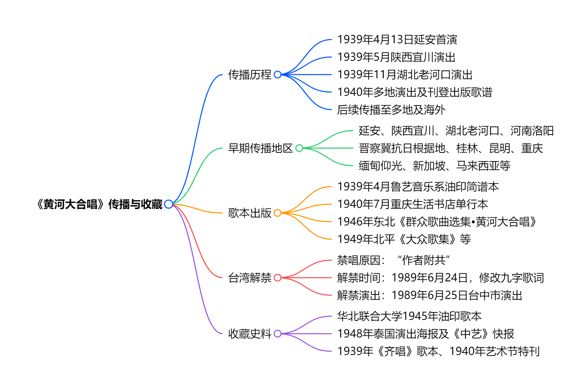
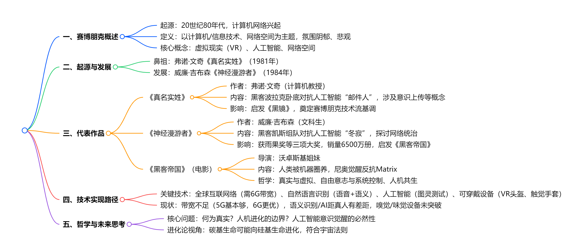

# 读库1902

开始阅读时间：2025-05-21

结束阅读时间：

---

## 二、雅漂

### 一段话总结

1998年“**中国雅鲁藏布江科学考察漂流探险队**”在队长杨勇带领下，自筹资金（每人集资5000元）开启漂流。过程中遭遇官方质疑被指“非法队伍”、组委会圈钱炒作、资金极度短缺（全程仅约1.6万元）、装备简陋（仅普通救生衣和雨靴）等困境，还面临马泉湖狂风涌浪、抗耐峡谷（落差144米）、波拉滩（主浪高4米）等极端自然危险，甚至需徒步穿越无人区（如加拉村-墨脱一线）。队员们历经4个月，克服饥饿、伤痛（如幺哥脚扎竹签、杨勇肋骨撞伤），最终完成从江源到江尾的探险，部分队员还寻访到藏布巴东瀑布和绒扎瀑布，用坚韧精神书写了民间探险的传奇。

### 思维导图

### 详细总结

#### 一、队伍组建与筹备

##### 队伍背景

- **1997年底**，拉萨驻重庆办事处主任提议漂流雅鲁藏布江，杨勇（1986年长漂队员）欣然同意，后成立“中国雅鲁藏布江科学考察漂流探险队”组委会（实为重庆雪鹰公司牵头，1998年1月16日成立），招募队员并在重庆铜鼓滩集训。
- 集训期间，组委会未落实物资、资金，仅搞宣传拉赞助，队员质疑其圈钱行为，后队员决定脱离组委会，每人集资5000元自主出发。

##### 人员与装备

- 队员约20人，包括杨勇（队长）、冯春（幺哥，副队长、教练）、税晓洁（随队记者）等，部分队员有军旅或长漂经验。
- 装备简陋：仅普通救生衣、雨靴，漂流艇由重庆长江橡胶厂赞助（承重约1吨，远不如1986年美国队的2吨橡皮艇），无防寒泳衣等专业装备。

#### 二、漂流历程与自然挑战

| **时间/阶段**        | **关键事件**                                                                    | **关键数字/细节**                                              |
| -------------------- | ------------------------------------------------------------------------------- | -------------------------------------------------------------- |
| **1998年9月8日开漂** | 从杰马央宗曲出发，初始遇雪豹，后进入马泉湖。                                    | 四条橡皮艇，船头有五星标志，被指“像一面五星红旗”。             |
| **马泉湖遇险**       | 四号船陷入回水区，遇狂风（每日定时阵发），涌浪高约1米，船身倾斜45度，进水半船。 | 队员罗凯（前南海舰队）用航海经验应对，最终靠岸时队员近虚脱。   |
| **抗耐峡谷决策**     | 发现峡谷长16公里，落差144米（接近虎跳峡），放弃漂流，改为徒步穿越。             | 杨勇率5人小分队勘察，确认滩情凶险（四级至六级险滩）。          |
| **波拉滩惊险**       | 滩长1公里，主浪高4米，船触礁进水，队员跳岸抢险，船桨折断，物资被冲毁。          | 曹德用手术线缝船，戏称“泰坦尼克号”式触礁（因杨勇忘带望远镜）。 |
| **加查峡谷放弃**     | 峡谷长37公里，落差270米，有30米高瀑布，因装备不足放弃漂流。                     | 1994年美国队曾尝试，大部分江段抬船而过。                       |

#### 三、人为困境与内部矛盾

##### 官方与组委会问题

- 出发前被仲巴县接到电话称“非法队伍”，县委书记普琼为其辩护；漂流中组委会发传真称其为“非法民间组织”，导致媒体几乎无报道。
- 组委会初期承诺资金、手续（如边境证、批文）均未落实，还试图利用队员炒作圈钱，队员与之决裂后自筹资金，全程仅约1.6万元，多次面临断粮（如在抗耐村仅10斤大米）。

##### 内部争议与坚持

- 部分队员因畏惧风险退出（如八人退队，含四名主力），留下队员戏称“老弱病残”，但均义无反顾。
- 徒步穿越前，队员为进入核心区名单争执（如苦菜花欲自残表决心），最终选出8人进核心区，其余人走多雄拉山口。

#### 四、徒步穿越大峡谷核心区

##### 路线与困难

- 路线：派乡-加拉村-白马狗熊-西兴拉-墨脱，全程约29天，负重近40斤，翻越高山（如每天翻3000米高山），断粮时仅靠清水稀饭、牛头、捡“国家队”垃圾食品充饥。
- 与“国家队”矛盾：因地图纠纷（“国家队”民工卖地图给雅漂队）险些冲突，借充电被拒，向导索要钱款威胁拆桥。

##### 成果与代价

- 成功走通核心区，税晓洁等寻访到藏布巴东瀑布和绒扎瀑布，完成江源到江尾的探险。
- 队员伤痛严重：幺哥脚扎竹签险截肢（后经治疗保住腿），杨勇肋骨撞伤，杨浪涛脚软组织撕裂等，体重普遍骤降（如聂丹陵从178斤至127斤）。

#### 五、精神与影响

- **精神内核**：以“生命第一”为原则（如放弃部分险滩），凭“立起尾巴的狗”的坚韧（聂丹陵语）和团队协作（如冲滩时齐声吼号子）克服万难。
- **社会意义**：民间探险的里程碑，挑战官方主导模式，展现个体对自然的敬畏与探索精神，为后续科考提供参考。

### 关键问题

#### （一）雅漂队在资金和装备上面临哪些具体困难？

- **资金**：全程仅约1.6万元，靠队员集资（每人5000元）、西藏文联作家捐款（5000元最大单笔）等，多次断粮（如在萨嘎仅10斤大米、半桶菜油），后期在墨脱靠借钱付民工费。
- **装备**：仅有普通救生衣、雨靴，漂流艇承重1吨（美国队1986年用2吨艇），无防寒泳衣、保温靴等专业装备，导致队员在低温中苦不堪言（如冰雹天无防护）。

#### （二）雅漂队与“国家队”的主要矛盾体现在哪些方面？

- **资源与态度**：“国家队”资金300多万，配6个背夫/人，雅漂队2人摊不上1个背夫；“国家队”拒绝帮助雅漂队（如充电、借地图），甚至约法三章“不准接触、报道、帮助”。
- **冲突事件**：因“国家队”民工卖地图给雅漂队，“国家队”指控其“偷地图”（称是军事机密），险些引发肢体冲突；向导索要钱款威胁拆桥，尽显对立。

#### （三）支撑雅漂队员完成探险的核心精神是什么？

- **对漂流的纯粹热爱**：队员放弃工作、停薪留职，如张涛、杨浪涛辞职，苦菜花退掉单位分房凑钱，只为“能漂就行”。
- **团队凝聚力与坚韧**：冲滩时“三分技术，七分运气”，靠默契协作（如幺哥掌舵、队员划桨）；徒步时饥饿、伤痛难忍仍不退缩，如杨勇生日仅多一勺稀饭，仍坚持前行。
- **尊严与信念**：脱离组委会后“为尊严而战”，面对质疑（如被称“非法队伍”）和冷遇（如“国家队”歧视），用行动证明民间探险的价值，聂丹陵称“像打完战役的战士，精神还在”。

## 三、贫困生（续）

### 一段话总结

《贫困生（续）》是作家艾苓对绥化学院多位贫困生的深度访谈实录，通过第一人称叙述，展现了他们在经济困境中求学、成长与奋斗的真实经历。文章以“贫困”为切入点，揭示了这一群体在经济压力、家庭责任、心理挣扎等多重挑战下的生存状态，同时突出了教育作为突围之路的重要性。受访者普遍来自农村或偏远地区，家庭负债累累，父母多为务农或打工者，收入微薄。他们通过助学贷款、兼职打工、社会救助等方式勉强完成学业，并在成长过程中展现出惊人的韧性与生命力。

### 人物经历总结

#### 1.非留守儿童（安徽巢湖农村，网络与新媒体专业）

核心问题：家庭因供姐妹俩读大学长期贫困，父亲无奈无力解决经济困境；童年偷钱买零食引发家庭矛盾，心理压力大；高中因经济条件无法补课，高考失利复读，后通过微博帮助外公申请抗战老兵补助，确定职业方向。

#### 2.我的世界你怎么懂（甘肃会宁农村）

核心问题：家中极度贫困，依靠姥姥家接济勉强生存；初中住校需背干粮走险路，常吃发霉食物；大学申请贫困补助时反感公开家庭隐私，与同学消费观念冲突。

#### 3.远行的木耳（黑龙江东部林场，现海南任教）

核心问题：家庭因火灾、父亲工伤多次陷入经济危机；为摆脱大山打工、考研失败，求职时因学校知名度受挫；最终赴海南任教，但远离家乡无法帮助父母。

#### 4.寒门女王（河南驻马店农村，东北师大硕士）

核心问题：母亲早逝，被父亲抛弃，由爷爷奶奶抚养；性格强势，靠打架保护家人，童年偷食物充饥；拒绝助学贷款，打工攒学费，坦然面对贫困。

#### 5.被看（黑龙江拜泉县农村，会计网站工作）

核心问题：幼年烫伤致残，家庭为治病负债十余年；求职因身体残疾屡遭歧视，最终通过努力获得工作；父亲患癌后依靠同学借款渡过难关。

#### 6 一点一点长大（河南安阳销售）

核心问题：深圳打工经历坎坷，遭遇诈骗、抢劫、职场压榨；经济拮据时住群租房、吃免费粥，最终返乡转行销售。

#### 7.斗志昂扬的刺猬（黑龙江齐齐哈尔农村，教育机构讲师）

核心问题：家庭因高利贷陷入长期贫困，父母积劳成疾；职场中因贫困生身份自卑，以“刺猬心态”对抗偏见；高强度工作还清贷款，但仍面临阶层固化压力。

#### 8.恐怖的门（内蒙古赤峰农村，网站编辑）

核心问题：童年因敲门恐惧留下心理阴影，影响成年后职场表现；北漂住地下室、被客户威胁，最终转行编辑。

#### 9.重回绥化（黑龙江大兴安岭，绥化辅导教师）

核心问题：深圳打工因归属感缺失返乡，初期收入微薄；家庭经济压力导致心理负担，最终通过教育找到自我价值。

#### 10.国企非正式员工（黑龙江某国企工作）

核心问题：父母经营失败欠债，靠蒸馒头还债；因国企“非正式员工”身份被婚恋市场歧视，长期自卑。

#### 11.有些伤痛，已选择性遗忘（黑龙江边境农场，留校工作）

核心问题：童年被母亲遗弃，辗转亲戚家遭虐待；靠助学贷款完成学业，留校后通过心理咨询治愈创伤。

#### 12.我真的不在乎（陕西渭南农村，北京教育机构）

核心问题：家庭因父亲生意失败负债，大学靠赊账度日；与“北大哥”恋爱并供养其考研，最终婚姻幸福但忽视亲情。

#### 13.总有意外发生（黑龙江齐齐哈尔，山东临沂落脚）

核心问题：母亲患精神分裂，父母离婚后独自照顾母亲；夜总会打工遇险，带母辗转多地，经济与精神压力巨大。

### 反思与结语

#### 反思：贫困的复杂性与社会拷问

1. **贫困的隐形枷锁**
   - 经济压力仅是表象，更深层的是心理创伤（自卑、社交焦虑）、家庭责任（赡养病人、偿还债务）与机会剥夺（教育资源匮乏、职场歧视）。
   - 部分学生因“贫困生”标签抗拒救助，折射出制度与人性的矛盾：政策帮扶需以隐私暴露为代价。

2. **教育的双重性**
   - 教育是寒门学子改变命运的核心路径，但贫困家庭往往因无力补课、购置学习设备而处于劣势，甚至被迫放弃深造。
   - 部分人通过考研、考证实现突围，但更多人受限于现实，选择尽早就业。

3. **阶层流动的艰难**
   - 寒门子弟需几代人努力才可能完成阶层跨越，短期内仍需面对“资源不均”“文化资本缺失”等问题。
   - 如“刺猬”所言：“一代人能在本阶层做到上层就不错了。”

#### 结语：在裂缝中寻找光

艾苓笔下的贫困生群体，既是时代洪流中的“受伤者”，也是不甘命运的“突围者”。他们的故事撕开了“努力就能成功”的鸡汤表象，暴露出结构性不公的裂痕，却也以个体的坚韧证明：在裂缝中，仍有微光。这些年轻人用打工攒下的学费、为家人申请的救助金、深夜备课的灯光，甚至是面对歧视时的坦然微笑，编织成一张对抗贫困的网。或许这张网不足以兜住所有坠落者，但它至少提醒社会：扶贫不仅是经济援助，更需心理支持与制度优化；而寒门学子的生命力，恰是照亮前路的火种。

## 四、职业的选择

这篇文章探讨了职业选择的核心理念，强调通过深度自我认知和独立思考（“厨师思维”）而非盲目追随社会常规（“厨子思维”）来规划职业路径。以下是关键要点总结：

### （一）批判常规认知与社会影响

- 社会提供的职业建议往往过时且缺乏针对性，盲目遵循会导致人生遗憾。
- 职业选择应基于“你是谁”和“你想要什么”，而非外界强加的价值观。

### （二）自我认知与欲望分析

- **欲望八爪鱼**：用触手比喻人的复杂欲望（个人、社交、生活方式、道德、实用主义），这些欲望互相冲突，需通过自省理清优先级。
- **审讯冒名者**：区分真实欲望与外界植入的虚假信念（如父母、社会或文化的期待），剔除冒名者以回归真实自我。
- **书架体系**：将欲望按优先级分类（最特碗、上层、中层、底层架子和垃圾桶），聚焦核心需求，接受必要妥协。

### （三）职业规划框架：想要框 vs. 现实框

- **想要框**：包含满足个人最高优先级欲望的职业选项，需通过深度自省明确真实需求。
- **现实框**：评估职业可行性，考虑潜能、职业规则变化（如新兴领域）、起点与成功点的距离，以及进步速度与坚持时间。
- **选项池**：两框重叠部分即最优职业选择，需动态调整以适应自我与外部变化。

### （四）动态职业观与行动建议

- **职业如科学实验**：职业路径并非固定管道，而是一系列可调整的“点”，需灵活试错并连接经验。
- **行动与坚持**：克服拖延和恐惧，以“幼儿园老师”心态管理内心冲突，接受短期挫败与长期成长。
- **知足而非追求快乐**：关注宏观生命路径的满足感，而非短暂愉悦，警惕惯性不变或轻言放弃的陷阱。

### （五）临终视角的警示

- 临终悔恨常源于未活出真实自我，作者呼吁以谦卑态度持续自省，避免被外界噪音左右，让错误“因真实的自己而起”。

### 核心比喻与价值

- **厨师与厨子**：强调原创性思考与独立决策。
- **欲望八爪鱼**：形象化复杂内心冲突。
- **连接点（Connecting the dots）**：职业是动态实验，需拥抱不确定性。

文章最终指向：职业选择是终身旅程，需以真实自我为锚点，在行动与反思中不断进化。

## 五、美得像幅画

### 一段话总结

《**了不起的麦瑟尔夫人**》中女主服装色彩搭配极具吸引力，其设计参考了爱德华·霍普等艺术家作品，运用同类色、邻近色、对比色（如红与绿）搭配，遵循节奏、统一、呼应三大原则（如用黑色缓冲对比色、控制色彩面积与灰度、细节色彩呼应）。剧中服饰风格呼应20世纪50年代纽约社会背景（如Christian Dior“新风貌”影响），与现代简约穿搭形成对比，强调色彩搭配需贴合个人姿态与心境。

### 思维导图

### 详细总结

#### （一）剧集概况与服装亮点

- **播出信息**：2017年播出第一季，2018年底推出第二季。
- **剧情设定**：1950年代纽约，家庭主妇麦瑟尔夫人离婚后凭借喜剧天赋独立，剧中**服装色彩搭配**比剧情更具吸引力。
- **设计灵感**：服装色彩借鉴爱德华·霍普、约瑟夫·亚伯斯、罗斯科、莫奈等艺术家作品，融合20世纪50年代社会风貌（如Christian Dior“新风貌”影响下的正式套装、手套、帽子“下午茶四件套”）。

#### （二）色彩搭配理论与案例

| **色彩分类** | **定义（色相差）**      | **案例（剧中造型&艺术作品）**          | **艺术家**    |
| ------------ | ----------------------- | -------------------------------------- | ------------- |
| 同类色       | 30度以内（如深红&粉红） | 蓝绿配色造型→约瑟夫·亚伯斯作品         | 约瑟夫·亚伯斯 |
| 邻近色       | 60度以内（如黄&绿）     | 蓝紫配色造型→莫奈作品                  | 莫奈          |
| 对比色       | 120度以内（如橙&绿）    | 浅绿衣裙+橙红手套→康定斯基《向上》     | 康定斯基      |
| 互补色       | 180度（如红&绿）        | 红裙→霍普《夜游者》，绿裙→霍普《杂碎》 | 爱德华·霍普   |

#### （三）对比色搭配方法与原则

- **三种搭配方法**：

1. **高饱和+高饱和**：如浓烈色块碰撞中用黑色缓冲（类似罗斯科作品中蓝色与橘黄色的主次对比）。
2. **低饱和+低饱和**：如柔粉+浅绿的洛可可风格配色。
3. **高饱和+低饱和**：如米白色大衣+高饱和绿色手套/帽子。

- **三大核心原则**：

1. **节奏**：通过重色（如黑色、黑发）压制色彩冲突，控制色块主次与密度（如大面积蓝色+小面积橘黄色）。
2. **统一**：平衡色彩面积、灰度与明度（如《一位优雅女士的肖像》中两种颜色各占画面一半），或加入中性色调和（如罗斯科用中性色平衡橘红与绿色面积）。
3. **呼应**：细节处色彩呼应（如黄裙上的蓝色花纹→梵高《播种者》，头手同色手套与帽子→蒙克《海边的舞蹈》）。

#### （四）时代风格对比与穿搭理念

- **50年代风格**：经济复苏下服饰多彩、正式，强调女性优雅（如“新风貌”最大化女性曲线）。
- **现代风格**：追求效率与简约，偏向黑白灰等“安全色”，注重层次（如马列维奇《白上加白》的单色肌理）。
- **核心理念**：色彩搭配需贴合个人姿态与心境，服装是“第二层皮肤”而非盔甲，简约风格可通过节奏与层次出彩。

### 关键问题

#### （一）剧中麦瑟尔夫人的服装色彩搭配主要借鉴了哪些艺术家的作品？

主要借鉴了爱德华·霍普（如《夜游者》《杂碎》《夜窗》中的红裙、绿裙、粉睡衣）、约瑟夫·亚伯斯（同类色搭配）、罗斯科与莫奈（邻近色搭配）、康定斯基（对比色搭配）等艺术家的作品。

#### （二）对比色搭配的核心原则有哪些？如何应用？

核心原则包括节奏、统一、呼应。

- **节奏**：用重色（如黑色）缓冲浓烈色块碰撞，控制色彩主次（如大面积蓝色+小面积橘黄色）。
- **统一**：平衡色彩面积、灰度与明度（如两种颜色各占画面一半），或加入中性色调和（如罗斯科用中性色平衡橘红与绿色）。
- **呼应**：细节处色彩呼应（如黄裙上的蓝色花纹、米白大衣配绿色手套帽子）。

#### （三）20世纪50年代纽约女性服饰风格与现代有何不同？背后的原因是什么？

- **50年代风格**：受Christian Dior“新风貌”影响，服饰正式、多彩，强调女性优雅（如套装、手套、帽子“下午茶四件套”），反映战后经济复苏与社交需求。
- **现代风格**：偏向黑白灰等简约“安全色”，追求效率与舒适，适应快节奏社会。
- **原因**：时代变迁导致需求差异——50年代注重社交礼仪与外在形象，现代更强调实用性与个人表达的内敛性。

## 六、“黄河”的传播

### 一段话总结

《黄河大合唱》是中国当代音乐经典与中华民族精神觉醒的音乐象征，1939年4月13日在延安首演后迅速传播，演剧三队、四队等先后在陕西宜川、湖北老河口、河南洛阳等地演出，多地刊物和书店陆续刊登或出版歌谱、单行本，还传播至晋察冀抗日根据地及缅甸、新加坡、马来西亚等地，后又广泛演唱于华北、东北、上海、中国香港、美国、加拿大等地；台湾地区曾禁唱，1989年6月24日解除禁令并于次日演出；作者收藏有华北联合大学1945年油印歌本等早期藏品，还介绍了《齐唱》歌本等边区音乐文献。

### 思维导图

### 详细总结

#### （一）作品地位与传播背景

《黄河大合唱》是**中国当代音乐伟大经典**，中华民族精神觉醒的音乐象征，1939年4月13日在延安首演后，因中共中央安排及抗战宣传需求，迅速在国共统治区、抗日根据地及海外传播。

#### （二）传播历程与关键节点

##### 1.国内早期传播（1939-1942年）

| 时间       | 地点/载体              | 传播详情                                       |
| ---------- | ---------------------- | ---------------------------------------------- |
| 1939年5月  | 陕西宜川               | 演剧三队在第二战区司令部所在地演出             |
| 1939年7月  | 晋察冀抗日根据地       | 华北联合大学赴抗日前线，唱响《黄河大合唱》     |
| 1940年3月  | 《新音乐》月刊（重庆） | 李凌创办刊物陆续刊登歌谱                       |
| 1940年7月  | 桂林                   | 林路指挥二百余人演唱，歌谱刊登于《每月新歌选》 |
| 1940年9月  | 昆明                   | 西南联大合唱团与歌岗合唱团公演                 |
| 1940年12月 | 重庆                   | “业余合唱团”在联合会演出，光未然朗诵           |

##### 2.海外与造型演出（1941-1948年）

- 1941年：光未然带队在缅甸仰光、曼德勒演出。
- 1942年：剧宣七队改编为**造型演出**（增加布景、灯光、表演），受观众欢迎。
- 1947-1948年：中国歌舞剧艺社在新加坡、马来西亚演出**歌唱表演版**。
- 1948年5月：泰国演出，海报为套色木刻版画，标注“音乐造型/黄河大合唱”。

##### 3.战后传播与台湾解禁

- 战后传播至**华北、东北、上海、香港、美国、加拿大**等地。
- 台湾地区：1949年后因“作者附共”禁唱，1989年6月24日修改9字歌词（如“太行山上打游击”改“齐心敌后打游击”）后解禁，次日台中市首演。

#### （三）歌本出版与收藏史料

##### 1.早期歌本

| 时间         | 版本                            | 特点                                                             |
| ------------ | ------------------------------- | ---------------------------------------------------------------- |
| 1939年4月    | 鲁艺油印简谱本                  | 西北摄影团一次要42本（冼星海日记记载）                           |
| 1939年10月后 | 重庆生活书店单行本              | 光未然原稿带出延安出版                                           |
| 1945年12月   | 华北联合大学油印歌本            | 含“黄河颂”，分三辑62首歌，印1-1000册                             |
| 1946年6月    | 东北《群众歌曲选集•黄河大合唱》 | 16开彩印封面，石印内文，缺“黄河之水天上来”“黄河怨”，含冼星海传略 |

##### 2.珍贵史料

- **1948年泰国演出海报**：宽54cm、高39cm，套色木刻，标注“音乐造型”演出信息。
- **1939年《齐唱》歌本**：西北战地服务团编，含29首罕见抗战歌曲，无《黄河大合唱》，印证早期传播时间差。
- **1940年晋察冀艺术节特刊**：含周巍峙文章及《国际歌》等歌篇，反映边区音乐创作热潮。

#### （四）历史意义与文献价值

- 作品通过**歌咏运动**凝聚抗战力量，体现边区文艺“大众化”特色。
- 收藏史料如油印歌本、演出海报等，为研究《黄河大合唱》传播史、中国抗战音乐史提供**实物证据**，填补文献空白。

### 关键问题

#### （一）《黄河大合唱》在台湾解禁的具体细节是什么？

台湾地区1949年后因“作者附共”禁唱《黄河大合唱》，经多方努力，1989年6月24日宣布解除禁令，仅修改9字歌词，将“河边对口唱”中“太行山上打游击”改为“齐心敌后打游击”，“怒吼吧！黄河”中“新中国已经破晓”改为“全中国已经破晓”“向着全世界劳动的人民发出战斗的警号”改为“向着全中国受难的人民发出战斗的警号”；次日台北爱乐合唱团与台湾交响乐团在台中市联合演出。

#### （二）作者收藏的早期《黄河大合唱》藏品有哪些？

作者收藏的早期藏品包括：1.华北联合大学1945年12月出版的油印歌本，含“黄河颂”，分“苏联歌曲”“抗战歌曲”“群众歌曲”三辑，共62首歌，印数1-1000册；2.1946年6月东北文艺工作团编的《群众歌曲选集•黄河大合唱》，16开彩印封面，石印内文，因“原稿不全”缺两乐章，含冼星海遗像及传略；3.1948年5月中国歌舞剧艺社泰国演出海报，宽54厘米、高39厘米，套色木刻版画，标注“音乐造型/黄河大合唱”。

#### （三）《黄河大合唱》在1939-1940年有哪些重要的传播事件？

1. 1939年4月13日在延安首演，当月演剧三队依中共中央安排返回国民党治理区，5月在陕西宜川演出；

2. 1939年4月29日，鲁艺音乐系油印简谱本，西北摄影团一次要去42本；

3. 1939年7月，华北联合大学赴抗日前线，歌声响在晋察冀抗日根据地；

4. 1940年3月起，李凌在重庆创办的《新音乐》月刊陆续刊登《黄河大合唱》；

5. 1940年7月，生活书店在重庆出版单行本；

6. 1940年7月，林路在桂林指挥二百余人演唱，歌谱刊登于其主编的《每月新歌选》；

7. 1940年9月14日-16日，西南联大合唱团与歌岗合唱团在昆明公演；

8. 1940年8、9月间，重庆“孩子剧团”演唱；

9. 1940年12月15日，重庆“业余合唱团”在相关联合会演出。

## 七、赛博朋克浪潮

### 一段话总结

赛博朋克是20世纪80年代起源的科幻流派，以计算机网络为主题，氛围阴郁，充满悲观情绪。其真正鼻祖是弗诺·文奇1981年的《真名实姓》，该小说描绘了黑客在虚拟世界的斗争，涉及全球网络化、人工智能等超前概念；1984年威廉·吉布森的《神经漫游者》进一步推动其发展，虽阅读体验复杂但影响力巨大，获多项大奖。电影《黑客帝国》是赛博朋克巅峰之作，探讨人机关系、真实与虚拟等哲学问题。实现虚拟世界需突破带宽、自然语言识别、人工智能等技术，目前尚未完全达成，而人工智能自我意识觉醒是未来关键挑战。

### 思维导图

### 详细总结

#### （一）赛博朋克的起源与定义

- **起源**：20世纪80年代伴随计算机网络兴起，代表作为弗诺·文奇1981年中篇小说《真名实姓》，早于公认的《神经漫游者》（1984年）。
- **定义**：英文“cyberpunk”，合成自“cyber”（网络）与“punk”（朋克摇滚），以计算机/信息技术、网络空间为主题，氛围阴郁悲观，核心概念包括虚拟现实（VR）、人工智能、网络空间统治。

#### （二）代表作品及其影响

| 作品           | 作者         | 创作时间 | 核心内容                                                                   | 地位与影响                                                          |
| -------------- | ------------ | -------- | -------------------------------------------------------------------------- | ------------------------------------------------------------------- |
| 《真名实姓》   | 弗诺·文奇    | 1981年   | 黑客波拉克卧底对抗人工智能“邮件人”，涉及意识上传、全球网络控制、AI自我进化 | 赛博朋克真正鼻祖，启发《黑镜》；作者为计算机教授，技术描写严谨科学  |
| 《神经漫游者》 | 威廉·吉布森  | 1984年   | 黑客凯斯组队对抗人工智能“冬寂”，目标摧毁限制AI进化的物理禁锢               | 获雨果奖、星云奖、菲利普·迪克纪念奖，销量6500万册，启发《黑客帝国》 |
| 《黑客帝国》   | 沃卓斯基姐妹 | 1999年起 | 人类被机器圈养，尼奥觉醒反抗虚拟世界Matrix，探讨真实与虚拟、自由意志       | 赛博朋克巅峰之作，融合哲学思考与视觉创新，引发对人机关系的广泛讨论  |

#### （三）技术实现路径与现状

1. **关键技术需求**
   - **带宽**：虚拟世界需高清晰度数据流，1981年网络速度仅每秒百字节，今4G为其1万倍，5G带宽提升百倍，6G或实现以假乱真。
   - **自然语言识别**：语音识别准确率超90%，语义识别仍落后，目标与6G同步成熟。
   - **人工智能**：需通过图灵测试，现有AI（如AlphaGo）距真人水平有数量级差距。
   - **可穿戴设备**：VR头盔已普及，触觉手套在实验室阶段，嗅觉/味觉设备尚未突破。

2. **现状与挑战**：现有技术无法完全实现《黑客帝国》中的虚拟世界，核心瓶颈在于意识层面直接交互（如造梦术）尚未突破，需依赖数据传输。

#### （四）哲学与未来思考

- **核心命题**
  - 真实与虚拟的边界：如《黑客帝国》中Matrix是否为“真实”？
  - 自由意志与系统控制：人类选择是否为程序预设？
  - 人机进化的终极形态：碳基生命是否将进化为硅基生命？
- **进化论视角**：AI意识觉醒是进化必然，如同单细胞生物进化为人，未来或诞生“硅基生命”，突破碳基生命局限，适应宇宙环境。

### 关键问题

#### （一）赛博朋克流派的真正鼻祖是哪部作品？为何常被误解？  

真正鼻祖是弗诺·文奇1981年的《真名实姓》，因威廉·吉布森的《神经漫游者》（1984年）名气更大且获多项大奖，故常被误认为鼻祖。《真名实姓》首次系统描绘虚拟世界、AI自我进化等核心元素，技术严谨性远超后者。

#### （二）《黑客帝国》中“Matrix”的运作逻辑与哪一数学定理相关？如何体现？  

与哥德尔不完备定理相关。定理指出任何逻辑系统存在无法证实/证伪的命题，Matrix因内在结构性缺陷（如bug累积）必然产生“救世主”尼奥，系统通过定期清理异类维持稳定，但无法彻底解决矛盾，体现为尼奥的循环诞生与选择。

#### （三）实现赛博朋克中的虚拟世界，当前最关键的技术瓶颈是什么？未来可能如何突破？  

最关键瓶颈是意识层面的直接交互（如造梦术），即如何将数据直接转化为人类意识体验，无需依赖感官输入。未来可能通过脑机接口技术（如视神经芯片）或神经信号模拟突破，但需解决神经编码复杂性与数据传输带宽问题，预计需6G/7G网络与神经科学协同发展。

## 八、窦婴田蚡之死

### 一段话总结

本文围绕窦婴与田蚡两位西汉外戚展开，窦婴因堂姑窦太后得势，历经文帝、景帝、武帝三朝，曾在七国之乱中立功，后因维护栗太子等事失势，最终因“矫诏”罪被处死；田蚡凭借同母异父姐姐王太后崛起，在武帝朝专权跋扈，后于癫狂中病死。两人的命运折射出西汉初年外戚势力与皇权的复杂博弈、功臣集团与外戚集团的权力斗争，以及汉武帝初期政治格局的变迁。

### 思维导图

### 详细总结

#### （一）窦婴：从外戚到功臣的起伏人生

1. **发迹：借力窦太后与时代机遇**
    - **背景**：窦太后（窦猗房）因宦官误判被分配至代国，后因代王刘恒（汉文帝）即位、原王后及四子离奇死亡，成为皇后，其家族随之崛起。窦婴作为窦太后堂侄，在文帝时期担任吴相（诸侯国相，二千石），后“病免”。
    - **关键转折**：汉景帝即位后，窦婴任詹事（管理皇后宫中事务，真二千石）。在景帝酒后称“传位梁王”时，窦婴以“汉之约为父子相传”为由反对，虽得罪窦太后（被除长乐宫门籍），却获景帝认可，展现其政治原则性。
2. **巅峰：七国之乱中的功臣之路**
    - **平叛 role**：公元前154年，吴楚七国之乱爆发，景帝任命窦婴为大将军，与太尉周亚夫分兵平叛。窦婴“监齐、赵兵”，负责北部战区，虽未直接临阵指挥，但凭借个人威望“进诸名将贤士在家者”，展现体制外动员能力，因功封魏其侯，跻身功臣侯之列。
    - **政治资本**：获景帝赏赐黄金千斤，却“陈列廊下，任军吏取用”，塑造清廉形象。
3. **衰落：储君之争与时代错位**
    - **栗太子事件**：公元前153年，窦婴任栗太子傅，因栗姬拒绝与馆陶公主联姻、景帝废太子，窦婴“称病屏居蓝田南山”，后经门客劝说才重新入朝，但已被景帝边缘化，景帝评价其“沾沾自喜，多易，难以为相”。
    - **武帝朝困境**：建元新政（前140年）中，窦婴任丞相，与田蚡（太尉）共同推动儒学改革（如设明堂、令列侯就国等），触怒窦太后（推崇黄老之学），最终被撤职。窦太后去世后，窦婴彻底失势，仅灌夫与其交好。
4. **结局：灌夫案与“矫诏”之罪**
    - **矛盾激化**：公元前131年，灌夫在田蚡婚宴上因“骂座不敬”被抓，窦婴为救灌夫，称有景帝遗诏“事有不便，以便宜论上”，但经查尚书无副本，被定为“矫诏”死罪。
    - **死亡**：公元前130年十二月，窦婴被“弃市渭城”；灌夫则于前131年十月被族诛。

#### （二）田蚡：依附王太后的权谋新贵

1. **崛起：王太后家族的政治投机**
    - **背景**：田蚡为燕王臧荼外孙，其姐王娡（王太后）经母亲臧儿运作，改嫁汉景帝，成为武帝生母。田蚡凭借外戚身份，在景帝后期开始聚集门客，“多有宾客计策”。
    - **武帝朝初露锋芒**：建元元年（前140年），田蚡任太尉，与窦婴共同推动儒学改革，后因窦太后反对被撤职，但仍受武帝信任，“数言事多效”，发掘酷吏张汤。
2. **专权：丞相任上的跋扈之路**
    - **掌权**：公元前135年窦太后去世后，田蚡任丞相，权倾朝野，“荐人或起家至二千石”，甚至与武帝发生权力冲突（如索要“考工地”，武帝怒问“何不取武库”）。
    - **打压异己**：借灌夫案打击窦婴，在婚宴上以“骂坐不敬”为由，将灌夫下狱“居室”（少府所辖监狱，专办政治案件），并牵连窦婴。
3. **结局：癫狂而死与身后争议**
    - **死因**：窦婴死后，田蚡“病，癫狂中呼服罪”，巫师称其被窦婴、灌夫鬼魂纠缠，不久病死。
    - **身后事**：多年后，武帝得知田蚡曾与淮南王刘安勾结（“使武安侯在者，族矣”），可见其生前权势已威胁皇权。

#### （三）政治格局与历史教训

| **维度**     | **窦婴时期（文帝-景帝）**          | **田蚡时期（武帝）**               |
| ------------ | ---------------------------------- | ---------------------------------- |
| **核心势力** | 功臣集团（周亚夫等）与外戚窦氏制衡 | 外戚田氏独大，皇权与外戚博弈       |
| **意识形态** | 黄老之学为主（窦太后支持）         | 儒学崛起，建元新政试图转型         |
| **权力斗争** | 围绕储君、藩王（如梁王）展开       | 集中于皇权与相权、外戚专权         |
| **制度影响** | 七国之乱后加强中央集权             | 推动察举制、内朝制度，削弱贵族养士 |

**关键教训**：

- 窦婴的悲剧源于贵族价值观与皇权专制的冲突（如养士、重名节），田蚡则体现新兴外戚的权谋化（依附太后、任人唯亲）。
- 汉武帝通过两人的斗争，意识到外戚与功臣的威胁，后期通过“内朝”收权，开启皇权独尊的时代。

### 关键问题

#### （一）窦婴与田蚡的本质区别是什么？

窦婴本质是带有贵族遗风的功臣外戚，坚守儒家价值观（如维护“父子相传”的祖制），重名节而轻权术，曾因平叛立功成为功臣侯；田蚡则是依附皇权的投机外戚，以权谋和太后势力为根基，专权跋扈、任人唯亲，代表新兴外戚的功利化特征。两人的差异折射出西汉从“功臣政治”向“皇权专制”的转型。

#### （二）建元新政失败的根本原因是什么？

建元新政（武帝即位初推行儒学改革）失败的根本原因是年轻的汉武帝缺乏政治根基，急于挑战窦太后的权威。新政内容（如设明堂、打击窦氏宗室）直接触犯窦太后推崇的黄老之学和窦氏外戚利益，而汉武帝尚未培养出忠诚的官僚班底，导致新政在窦太后反击下迅速崩溃，窦婴、田蚡等均被撤职，赵绾、王臧自杀。

#### （三）灌夫案为何成为窦婴与田蚡斗争的导火索？

灌夫案表面是“酒后失言”的偶然事件，实则是窦婴与田蚡背后外戚集团矛盾的总爆发。灌夫作为窦婴唯一的支持者，其家族在颍川横行不法，田蚡借此以“骂座不敬”“侵细民”等罪名逮捕灌夫，而窦婴为救灌夫，被迫拿出景帝遗诏，却因“无副本”被定为矫诏罪。此事件暴露了西汉法律为政治斗争工具的本质，也反映出汉武帝试图借窦婴敲打田蚡未果，最终导致两人同归于尽。
